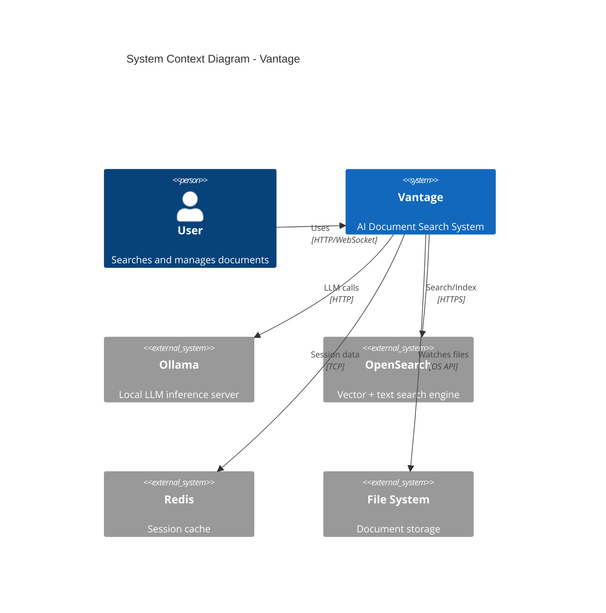
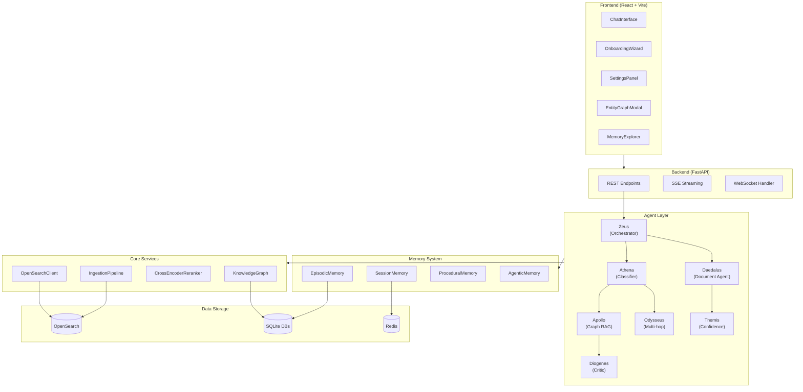
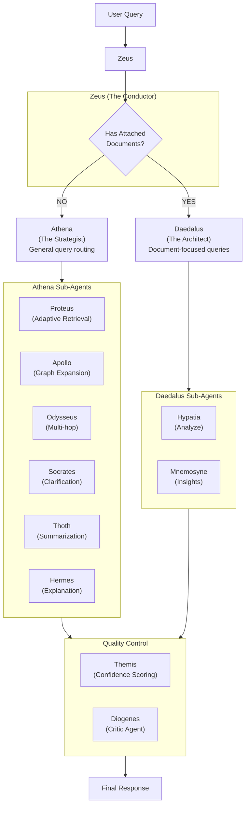
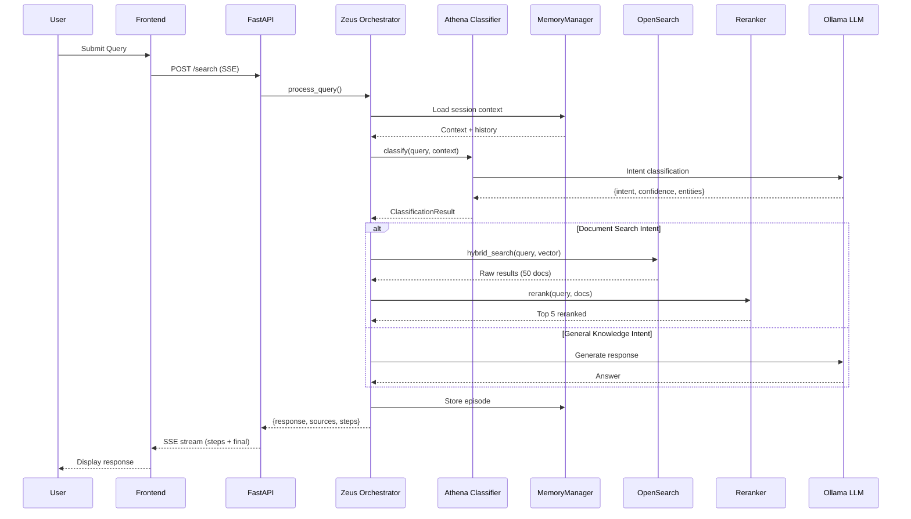
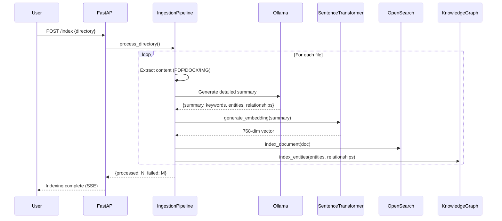
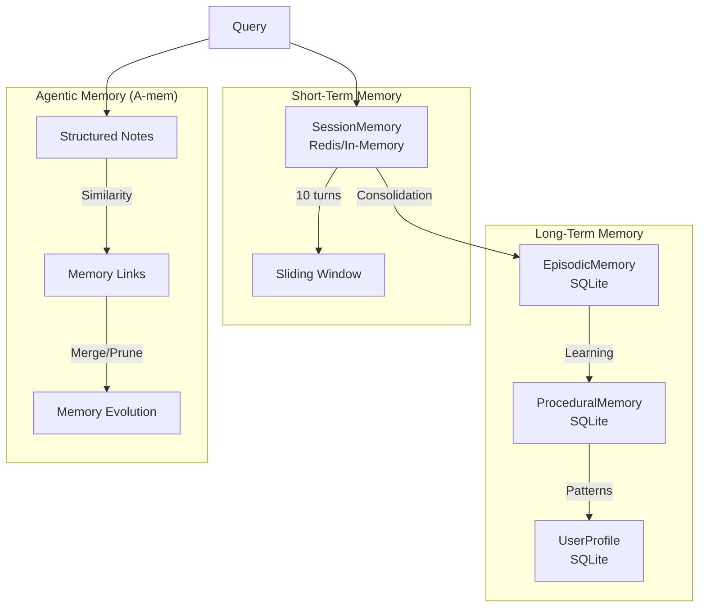

# Vantage Architecture

> Deep-dive technical architecture for the Vantage AI Document Search System

---

## Table of Contents

1. [System Overview](#system-overview)
2. [System Context Diagram](#system-context-diagram)
3. [Component Architecture](#component-architecture)
4. [Agent Architecture](#agent-architecture)
5. [Data Flow](#data-flow)
6. [Data Model](#data-model)
7. [Memory System](#memory-system)
8. [Design Decisions](#design-decisions)

---

## System Overview

Vantage is a **multi-agent AI system** that combines semantic search, knowledge graphs, and conversational AI. The architecture follows a Greek mythology naming convention where specialized agents handle different aspects of query processing.

### Key Architectural Principles

1. **Agent Specialization**: Each agent has a focused responsibility (classification, search, analysis, etc.)
2. **Stateful Orchestration**: LangGraph manages workflow state across agent interactions
3. **Hybrid Retrieval**: Combines vector similarity with lexical matching for better recall
4. **Multi-Tier Memory**: Session, episodic, procedural, and agentic memory layers
5. **Real-Time Streaming**: SSE for live updates during agent processing

---

## System Context Diagram



---

## Component Architecture



---

## Agent Architecture

### Greek Mythology Agent Hierarchy



### Agent Descriptions

| Agent | Role | Responsibility |
|-------|------|----------------|
| **Zeus** | The Conductor | Main orchestrator, routes queries to appropriate paths |
| **Athena** | The Strategist | Query classification and intent detection |
| **Daedalus** | The Architect | Handles document-attached queries |
| **Apollo** | Graph Expansion | Knowledge graph traversal for related entities |
| **Odysseus** | Multi-hop Reasoning | Decomposes complex queries into sub-queries |
| **Proteus** | Adaptive Retrieval | Dynamically selects retrieval strategy |
| **Themis** | Confidence Scoring | Scores response confidence, generates follow-ups |
| **Diogenes** | Critic Agent | Quality control and hallucination detection |
| **Socrates** | Clarification | Generates clarifying questions for ambiguous queries |
| **Thoth** | Summarization | Document summarization (comprehensive, brief, bullet) |
| **Hermes** | Explanation | Explains search results and ranking |

---

## Data Flow

### Query Processing Flow



### Document Ingestion Flow



---

## Data Model

### OpenSearch Index Schema

```json
{
  "mappings": {
    "properties": {
      "id": { "type": "keyword" },
      "filename": { "type": "text", "analyzer": "standard" },
      "file_type": { "type": "keyword" },
      "doc_type": { "type": "keyword" },
      "summary": { "type": "text", "analyzer": "english" },
      "full_content": { "type": "text" },
      "keywords": { "type": "keyword" },
      "entities": { "type": "keyword" },
      "topics": { "type": "keyword" },
      "embedding": {
        "type": "knn_vector",
        "dimension": 768,
        "method": {
          "name": "hnsw",
          "space_type": "cosinesimil"
        }
      },
      "created_at": { "type": "date" },
      "file_size": { "type": "long" },
      "file_path": { "type": "keyword" }
    }
  }
}
```

### SQLite Databases

| Database | Tables | Purpose |
|----------|--------|---------|
| `locallens_conversations.db` | conversations, messages | Chat history storage |
| `locallens_memory.db` | user_profiles, preferences | User profile and learning |
| `locallens_graph.db` | entities, relationships, mentions | Knowledge graph storage |
| `locallens_episodes.db` | episodes, outcomes | Episodic memory for learning |

---

## Memory System



### Memory Layer Descriptions

| Layer | Backend | TTL | Purpose |
|-------|---------|-----|---------|
| **Session** | Redis / In-memory | 1 hour | Current conversation context |
| **Episodic** | SQLite | Permanent | Past query-response pairs for learning |
| **Procedural** | SQLite | Permanent | Learned patterns and preferences |
| **User Profile** | SQLite | Permanent | User preferences and analytics |
| **Agentic (A-mem)** | OpenSearch | 30 days (prunable) | Structured notes with evolution |

---

## Design Decisions

### 1. Hybrid Search over Pure Vector Search

**Decision**: Use Reciprocal Rank Fusion (RRF) combining k-NN vectors with BM25 text matching.

**Rationale**:

- Pure vector search misses exact keyword matches
- BM25 alone cannot capture semantic similarity
- RRF fusion with 0.7 vector / 0.3 BM25 weights balances both

**Trade-off**: Increased query latency (~2x) but significantly improved recall.

### 2. Local Embeddings with Sentence Transformers

**Decision**: Use `sentence-transformers` (`nomic-embed-text`) instead of Ollama embeddings.

**Rationale**:

- Ollama embedding endpoint was unstable under load (HTTP 500 errors)
- Sentence Transformers runs locally on GPU with no HTTP overhead
- More consistent and faster embedding generation

**Trade-off**: Requires PyTorch and GPU memory but eliminates network instability.

### 3. Summary-Based Indexing (No Chunking)

**Decision**: Store one document entry per file with comprehensive summary instead of chunking.

**Rationale**:

- LLM-generated summaries are more searchable than raw chunks
- Full content stored separately for context during generation
- Reduces index size and simplifies retrieval

**Trade-off**: Very large documents may lose fine-grained details. Mitigated by including full content up to 50,000 chars.

### 4. LangGraph for Orchestration

**Decision**: Use LangGraph for stateful multi-agent workflows.

**Rationale**:

- Built-in state management across agent calls
- Declarative workflow definition with conditional routing
- Easy to add/modify agents without rewriting orchestration logic

**Trade-off**: Added dependency complexity, but provides cleaner agent composition.

### 5. Greek Mythology Agent Naming

**Decision**: Name agents after Greek gods/figures based on their roles.

**Rationale**:

- Memorable and thematic consistency
- Clear mapping between mythological role and agent function
- Makes debugging logs more human-readable

**Trade-off**: Learning curve for new developers, but aids long-term maintainability.

---

## Performance Considerations

| Operation | Typical Latency | Bottleneck |
|-----------|----------------|------------|
| Query Classification | 200-500ms | LLM inference |
| Hybrid Search | 50-150ms | OpenSearch query |
| Reranking (top 50→5) | 100-300ms | Cross-encoder inference |
| LLM Response Generation | 1-5s | LLM streaming |
| Document Ingestion | 5-30s/doc | LLM summarization |

### Optimization Strategies

1. **Caching**: Redis caches session context to avoid repeated loads
2. **Batch Processing**: Ingestion processes files in batches of 3 concurrently
3. **GPU Acceleration**: Embeddings and cross-encoder use CUDA when available
4. **Streaming**: SSE provides progressive feedback during long operations
