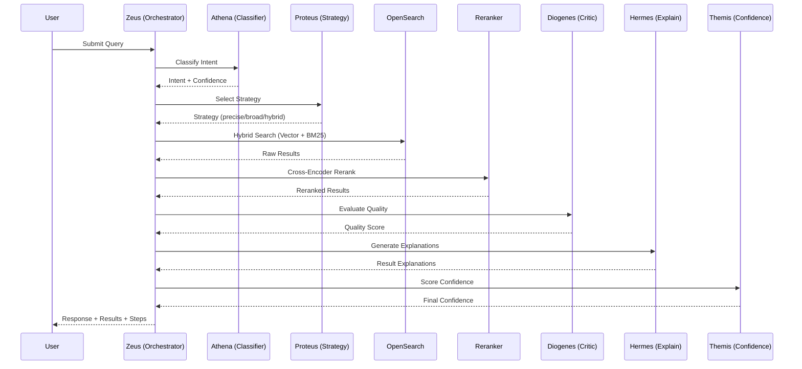

# 🏗️ System Architecture

> Technical deep-dive into Vantage's multi-agent RAG architecture

---

## Table of Contents

1. [High-Level Architecture](#high-level-architecture)
2. [Agent System](#agent-system)
3. [Search Pipeline](#search-pipeline)
4. [Document Ingestion Pipeline](#document-ingestion-pipeline)
5. [Knowledge Graph](#knowledge-graph)
6. [Memory System](#memory-system)
7. [Data Flow Diagrams](#data-flow-diagrams)
8. [Technology Stack](#technology-stack)

---

## High-Level Architecture

```
┌─────────────────────────────────────────────────────────────────────────────┐
│                              USER INTERFACE                                  │
│  ┌─────────────────────────────────────────────────────────────────────────┐│
│  │                        React Frontend (Vite)                            ││
│  │  ┌──────────────┐ ┌──────────────┐ ┌──────────────┐ ┌────────────────┐ ││
│  │  │ChatInterface │ │DocumentSel. │ │EntityGraph   │ │SettingsPanel  │ ││
│  │  │  - Messages  │ │  - Attach   │ │  - Canvas    │ │ - Indexing    │ ││
│  │  │  - Results   │ │  - Browse   │ │  - Nodes     │ │ - Config      │ ││
│  │  │  - Steps     │ │             │ │  - Edges     │ │               │ ││
│  │  └──────────────┘ └──────────────┘ └──────────────┘ └────────────────┘ ││
│  └─────────────────────────────────────────────────────────────────────────┘│
└─────────────────────────────────────────────────────────────────────────────┘
                                    │
                          HTTP REST + SSE (Real-time Steps)
                                    │
┌─────────────────────────────────────────────────────────────────────────────┐
│                           API LAYER (FastAPI)                                │
│  ┌───────────────────────────────────────────────────────────────────────┐  │
│  │                         backend/api.py                                 │  │
│  │  ┌──────────────┐ ┌──────────────┐ ┌──────────────┐ ┌──────────────┐  │  │
│  │  │/search       │ │/documents    │ │/index        │ │/conversations│  │  │
│  │  │/enhanced     │ │/{id}/entities│ │/start        │ │              │  │  │
│  │  └──────────────┘ └──────────────┘ └──────────────┘ └──────────────┘  │  │
│  └───────────────────────────────────────────────────────────────────────┘  │
└─────────────────────────────────────────────────────────────────────────────┘
                                    │
┌─────────────────────────────────────────────────────────────────────────────┐
│                        ORCHESTRATION LAYER                                   │
│  ┌───────────────────────────────────────────────────────────────────────┐  │
│  │              EnhancedOrchestrator (Zeus - The Conductor)              │  │
│  │  ┌─────────────────────────────────────────────────────────────────┐  │  │
│  │  │                      LangGraph Workflow                          │  │  │
│  │  │  classify → load_context → document_search → explain → finalize │  │  │
│  │  └─────────────────────────────────────────────────────────────────┘  │  │
│  └───────────────────────────────────────────────────────────────────────┘  │
│                                                                              │
│  ┌─────────────────────────────────────────────────────────────────────────┐│
│  │                         AGENT ARMIES                                    ││
│  │                                                                         ││
│  │  ┌─ ATHENA PATH ─────────────────────────────────────────────────────┐ ││
│  │  │ QueryClassifier → AdaptiveRetriever → HybridSearch → Reranker    │ ││
│  │  │        ↓                  ↓                            ↓          │ ││
│  │  │  (Intent)          (Strategy)                    (Precision)      │ ││
│  │  └───────────────────────────────────────────────────────────────────┘ ││
│  │                                                                         ││
│  │  ┌─ DAEDALUS PATH ───────────────────────────────────────────────────┐ ││
│  │  │ Prometheus → Hypatia → Mnemosyne → Daedalus                       │ ││
│  │  │ (Extract)  (Analyze)  (Remember)  (Orchestrate)                   │ ││
│  │  └───────────────────────────────────────────────────────────────────┘ ││
│  │                                                                         ││
│  │  ┌─ QUALITY AGENTS ──────────────────────────────────────────────────┐ ││
│  │  │ Diogenes (Critic) + Themis (Confidence) + Hermes (Explain)        │ ││
│  │  └───────────────────────────────────────────────────────────────────┘ ││
│  └─────────────────────────────────────────────────────────────────────────┘│
└─────────────────────────────────────────────────────────────────────────────┘
                                    │
┌─────────────────────────────────────────────────────────────────────────────┐
│                           DATA LAYER                                         │
│  ┌───────────────────┐ ┌───────────────────┐ ┌───────────────────────────┐  │
│  │    OpenSearch     │ │      SQLite       │ │        Ollama             │  │
│  │  ┌─────────────┐  │ │  ┌─────────────┐  │ │  ┌─────────────────────┐  │  │
│  │  │ Vector Index│  │ │  │conversations│  │ │  │ qwen2.5:7b (Text)  │  │  │
│  │  │ (k-NN HNSW) │  │ │  │ episodes    │  │ │  │ llava:7b (Vision)  │  │  │
│  │  │             │  │ │  │ users       │  │ │  └─────────────────────┘  │  │
│  │  │ BM25 Index  │  │ │  │ feedback    │  │ │                           │  │
│  │  └─────────────┘  │ │  │ graph       │  │ │  ┌─────────────────────┐  │  │
│  └───────────────────┘ │  └─────────────┘  │ │  │ Sentence-Transformers│ │  │
│                        └───────────────────┘ │  │ (nomic-embed-text)  │  │  │
│                                              │  └─────────────────────┘  │  │
│                                              └───────────────────────────┘  │
└─────────────────────────────────────────────────────────────────────────────┘
```

---

## Agent System

### Agent Hierarchy

```
                            ⚡ ZEUS (Conductor)
                          EnhancedOrchestrator
                                  │
          ┌───────────────────────┼───────────────────────┐
          │                       │                       │
    ┌─────▼─────┐          ┌──────▼──────┐         ┌──────▼──────┐
    │  ATHENA   │          │  DAEDALUS   │         │   APOLLO    │
    │ (Strategy)│          │ (Documents) │         │   (Graph)   │
    └─────┬─────┘          └──────┬──────┘         └──────┬──────┘
          │                       │                       │
    ┌─────▼─────┐          ┌──────▼──────┐         ┌──────▼──────┐
    │  PROTEUS  │          │ PROMETHEUS  │         │ Knowledge   │
    │(Retrieval)│          │  (Extract)  │         │   Graph     │
    └─────┬─────┘          └──────┬──────┘         └─────────────┘
          │                       │
    ┌─────▼─────┐          ┌──────▼──────┐
    │ SISYPHUS  │          │  HYPATIA    │
    │(Iterative)│          │  (Analyze)  │
    └─────┬─────┘          └──────┬──────┘
          │                       │
    ┌─────▼─────┐          ┌──────▼──────┐
    │ DIOGENES  │          │ MNEMOSYNE   │
    │ (Critic)  │          │ (Remember)  │
    └─────┬─────┘          └─────────────┘
          │
    ┌─────▼─────┐
    │  HERMES   │
    │ (Explain) │
    └─────┬─────┘
          │
    ┌─────▼─────┐
    │  THEMIS   │
    │(Confidence│
    └───────────┘
```

### Agent Descriptions

| Agent | Greek Name | Role | File |
|-------|------------|------|------|
| **Zeus** | Conductor | Master orchestrator, routes queries | `orchestrator.py` |
| **Athena** | Strategist | Intent classification, query understanding | `query_classifier.py` |
| **Proteus** | Shape-Shifter | Adaptive retrieval strategy selection | `adaptive_retriever.py` |
| **Apollo** | Illuminator | Knowledge graph expansion | `graph_rag_agent.py` |
| **Odysseus** | Voyager | Multi-hop reasoning | `reasoning_planner.py` |
| **Hermes** | Messenger | Result explanation | `explanation_agent.py` |
| **Diogenes** | Critic | Quality evaluation | `critic_agent.py` |
| **Themis** | Arbiter | Confidence scoring | `confidence_scorer.py` |
| **Sisyphus** | Controller | Iterative retrieval with correction | `retrieval_controller.py` |
| **Daedalus** | Architect | Document-specific orchestration | `document_agents/` |
| **Aristotle** | Analyst | Deep analysis | `analysis_agent.py` |

---

## Search Pipeline

### Query Processing Flow



### Retrieval Strategies

| Strategy | When Used | Vector Weight | BM25 Weight |
|----------|-----------|---------------|-------------|
| **Precise** | Specific keywords, entity names | 0.4 | 0.6 |
| **Broad** | Exploratory, conceptual queries | 0.7 | 0.3 |
| **Hybrid** | Default balanced | 0.5 | 0.5 |
| **Semantic** | Abstract concepts | 0.8 | 0.2 |

---

## Document Ingestion Pipeline

```
┌─────────────────────────────────────────────────────────────────┐
│                    INGESTION PIPELINE                            │
└─────────────────────────────────────────────────────────────────┘
                              │
                    ┌─────────▼─────────┐
                    │  File Discovery   │
                    │  (Watcher/Manual) │
                    └─────────┬─────────┘
                              │
                    ┌─────────▼─────────┐
                    │ Content Extraction│
                    │ PDF→Text, DOCX→   │
                    │ Text, Image→OCR   │
                    └─────────┬─────────┘
                              │
                    ┌─────────▼─────────┐
                    │   LLM Summary     │
                    │ + Keywords        │
                    │ + Entities        │
                    └─────────┬─────────┘
                              │
               ┌──────────────┼──────────────┐
               │              │              │
     ┌─────────▼─────────┐    │    ┌─────────▼─────────┐
     │  Vector Embedding │    │    │  Knowledge Graph  │
     │ (nomic-embed-text)│    │    │  (Entity Store)   │
     └─────────┬─────────┘    │    └─────────┬─────────┘
               │              │              │
               └──────────────▼──────────────┘
                              │
                    ┌─────────▼─────────┐
                    │   OpenSearch      │
                    │   Index Document  │
                    └───────────────────┘
```

### Supported File Types

| Type | Extension | Extraction Method |
|------|-----------|-------------------|
| PDF | `.pdf` | PyPDF2 text extraction |
| Word | `.docx` | python-docx |
| Text | `.txt`, `.md` | Direct read |
| Excel | `.xlsx`, `.csv` | Pandas DataFrame |
| Image | `.png`, `.jpg` | Ollama Vision (llava) |

---

## Knowledge Graph

### Entity Model

```python
@dataclass
class Entity:
    id: str              # Unique identifier
    name: str            # Entity name
    entity_type: str     # PERSON, ORG, LOCATION, etc.
    properties: Dict     # Additional metadata
    document_ids: List   # Documents mentioning entity
```

### Relationship Model

```python
@dataclass
class Relationship:
    source_id: str           # Source entity
    target_id: str           # Target entity
    relationship_type: str   # WORKS_FOR, LOCATED_IN, etc.
    weight: float           # Relationship strength
    document_id: str        # Source document
```

### Graph Storage

- **Runtime**: NetworkX DiGraph
- **Persistence**: SQLite (`locallens_graph.db`)
- **Queries**: Multi-hop traversal for entity expansion

---

## Memory System

### Memory Types

| Type | Purpose | Storage | Lifespan |
|------|---------|---------|----------|
| **Session** | Current conversation context | In-memory | Session |
| **Episodic** | Important interactions | SQLite | Permanent |
| **Feedback** | User result ratings | SQLite | 30 days decay |

### Memory Manager

```python
class MemoryManager:
    - record_interaction(query, response, context)
    - get_session_context(session_id)
    - get_relevant_memories(query, limit)
    - summarize_history(messages)
```

---

## Data Flow Diagrams

### Search Request Flow

```
User Query
    │
    ▼
┌───────────────────────────────────────────────────────────────┐
│ POST /search/enhanced                                          │
│ {query, user_id, conversation_id, attached_documents}         │
└───────────────────────────────────────────────────────────────┘
    │
    ▼
┌───────────────────────────────────────────────────────────────┐
│ EnhancedOrchestrator.process()                                 │
│   ├── Load session context from MemoryManager                  │
│   ├── Check for attached documents → Daedalus Path            │
│   └── No attachments → Athena Path                            │
└───────────────────────────────────────────────────────────────┘
    │
    ▼ (Athena Path)
┌───────────────────────────────────────────────────────────────┐
│ QueryClassifier.classify()                                     │
│   ├── Rule-based classification                                │
│   └── LLM-based classification (if ambiguous)                 │
│   Returns: {intent, confidence, entities}                      │
└───────────────────────────────────────────────────────────────┘
    │
    ▼
┌───────────────────────────────────────────────────────────────┐
│ AdaptiveRetriever.select_strategy()                            │
│   ├── Analyze query characteristics                            │
│   └── Select: precise | broad | hybrid | semantic             │
└───────────────────────────────────────────────────────────────┘
    │
    ▼
┌───────────────────────────────────────────────────────────────┐
│ OpenSearchClient.hybrid_search()                               │
│   ├── Vector search (k-NN)                                     │
│   ├── BM25 text search                                         │
│   └── Reciprocal Rank Fusion                                   │
└───────────────────────────────────────────────────────────────┘
    │
    ▼
┌───────────────────────────────────────────────────────────────┐
│ CrossEncoderReranker.rerank()                                  │
│   ├── Score all query-document pairs                           │
│   ├── Apply diversity (MMR)                                    │
│   └── Apply feedback boosts                                    │
└───────────────────────────────────────────────────────────────┘
    │
    ▼
┌───────────────────────────────────────────────────────────────┐
│ Quality & Explanation                                          │
│   ├── CriticAgent.evaluate_quality()                           │
│   ├── ExplanationAgent.explain_results()                       │
│   └── ConfidenceScorer.score()                                │
└───────────────────────────────────────────────────────────────┘
    │
    ▼
┌───────────────────────────────────────────────────────────────┐
│ Response                                                       │
│ {                                                              │
│   results: [...],                                              │
│   response_message: "...",                                     │
│   confidence: 0.85,                                            │
│   steps: [...],                                                │
│   agents_used: [...]                                           │
│ }                                                              │
└───────────────────────────────────────────────────────────────┘
```

---

## Technology Stack

### Backend
- **FastAPI** - High-performance async API
- **LangGraph** - Agent workflow orchestration
- **OpenSearch** - Vector + BM25 hybrid search
- **Sentence-Transformers** - Local embeddings
- **Ollama** - Local LLM inference
- **NetworkX** - Knowledge graph
- **SQLite** - Lightweight persistence

### Frontend
- **React 18** - UI framework
- **Vite** - Build tool
- **Canvas API** - Graph visualization

### Infrastructure
- **Docker** - OpenSearch containerization
- **Uvicorn** - ASGI server

---

## Performance Considerations

### Optimizations

1. **Embedding Cache** - Local sentence-transformers avoid Ollama latency
2. **Connection Pooling** - Reused OpenSearch connections
3. **Async Operations** - Non-blocking I/O throughout
4. **Batch Processing** - Document ingestion in configurable batches
5. **Result Caching** - Memoized expensive computations

### Scaling

- **Horizontal**: Add OpenSearch nodes
- **Vertical**: GPU for embeddings and LLM
- **Caching**: Redis for query cache (future)

---

## Security

- **Authentication**: JWT-based user authentication
- **Authorization**: User-scoped conversations and feedback
- **Secrets**: Environment variables for credentials
- **SSL**: OpenSearch communication encrypted

---

<p align="center">
  <i>Architecture designed for extensibility and local-first AI</i>
</p>
