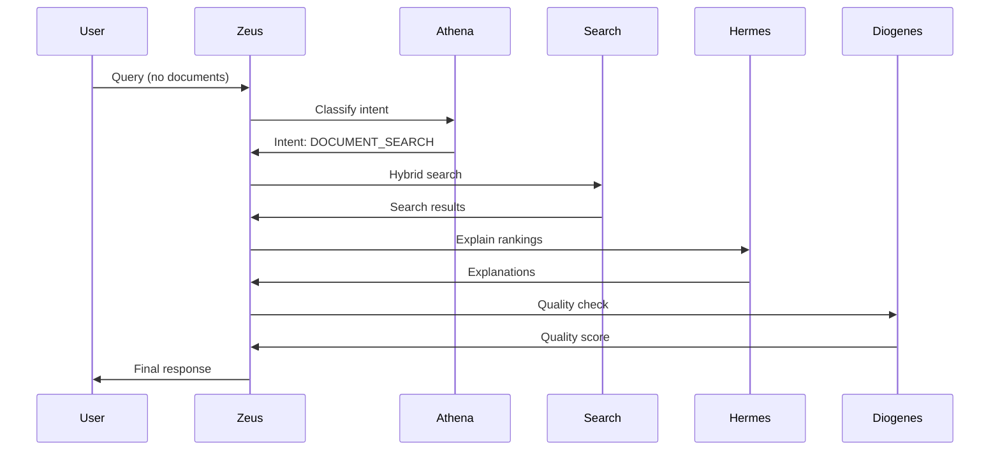
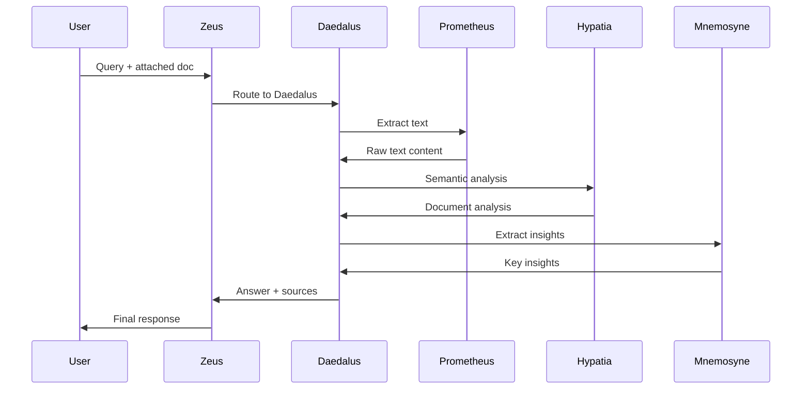
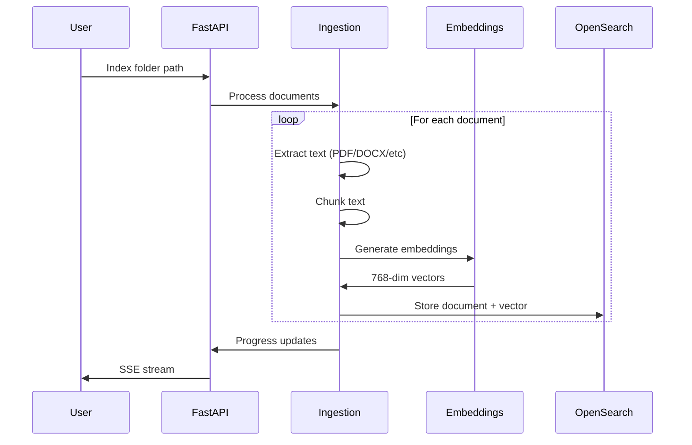

# Vantage Architecture Guide 🏛️

Comprehensive technical documentation of Vantage's multi-agent AI architecture.

---

## Table of Contents

1. [System Overview](#system-overview)
2. [Agent Architecture](#agent-architecture)
3. [Data Flow](#data-flow)
4. [Technology Stack](#technology-stack)
5. [API Reference](#api-reference)
6. [Database Schema](#database-schema)
7. [Configuration](#configuration)

---

## System Overview

Vantage is built on a **multi-agent architecture** inspired by the Greek Pantheon. Each agent has a specialized role, and they collaborate through the **Zeus orchestrator** to process user queries.

### High-Level Architecture

```
┌─────────────────────────────────────────────────────────────────────────┐
│                           FRONTEND (React + Vite)                       │
│   ┌──────────────┐  ┌──────────────┐  ┌──────────────┐                  │
│   │  Auth Pages  │  │ Chat Interface│  │ Index Panel  │                 │
│   └──────────────┘  └──────────────┘  └──────────────┘                  │
└─────────────────────────────────────────────────────────────────────────┘
                                    │
                                    │ HTTP / SSE
                                    ▼
┌─────────────────────────────────────────────────────────────────────────┐
│                           BACKEND (FastAPI)                             │
│  ┌─────────────────────────────────────────────────────────────────┐    │
│  │                    ZEUS ORCHESTRATOR (⚡)                        │  │
│  │    ┌─────────────────────┐    ┌─────────────────────────────┐   │   │
│  │    │    ATHENA PATH      │    │      DAEDALUS PATH          │   │   │
│  │    │   (No documents)    │    │   (Documents attached)      │   │   │
│  │    │                     │    │                             │   │   │
│  │    │  🦉 Athena          │    │  🏛️ Daedalus                │   │   │
│  │    │  📊 Aristotle       │    │  🔥 Prometheus              │   │   │
│  │    │  🤔 Socrates        │    │  📚 Hypatia                 │   │   │
│  │    │  📜 Thoth           │    │  🧠 Mnemosyne               │   │   │
│  │    │  📨 Hermes          │    │                             │   │   │
│  │    │  🔎 Diogenes        │    │                             │   │   │
│  │    └─────────────────────┘    └─────────────────────────────┘   │   │
│  └─────────────────────────────────────────────────────────────────┘   │
│                                    │                                    │
│           ┌────────────────────────┼────────────────────────┐          │
│           ▼                        ▼                        ▼          │
│  ┌──────────────┐      ┌───────────────────┐     ┌──────────────┐     │
│  │    Ollama    │      │    OpenSearch     │     │    SQLite    │     │
│  │  (LLM + Emb) │      │  (Vector + BM25)  │     │  (Storage)   │     │
│  └──────────────┘      └───────────────────┘     └──────────────┘     │
└─────────────────────────────────────────────────────────────────────────┘
```

---

## Agent Architecture

### The Greek Pantheon

Vantage uses a mythology-inspired naming convention for its AI agents:

| Agent | Icon | Greek Name | Title | Role |
|-------|------|------------|-------|------|
| Main Orchestrator | ⚡ | **Zeus** | The Conductor | Routes all queries to appropriate agents |
| Intent Classifier | 🦉 | **Athena** | The Strategist | Classifies query intent and extracts entities |
| Document Orchestrator | 🏛️ | **Daedalus** | The Architect | Handles document-attached queries |
| Text Extractor | 🔥 | **Prometheus** | The Illuminator | Extracts text from attached documents |
| Semantic Analyzer | 📚 | **Hypatia** | The Scholar | Performs semantic analysis of documents |
| Insight Extractor | 🧠 | **Mnemosyne** | The Keeper | Extracts key insights and facts |
| Analysis Agent | 📊 | **Aristotle** | The Analyst | Compares and analyzes multiple documents |
| Clarification Agent | 🤔 | **Socrates** | The Inquirer | Generates clarifying questions |
| Summarization Agent | 📜 | **Thoth** | The Scribe | Creates multi-document summaries |
| Explanation Agent | 📨 | **Hermes** | The Messenger | Explains search result rankings |
| Quality Control | 🔎 | **Diogenes** | The Critic | Evaluates response quality |

### Routing Logic

```
USER QUERY
    │
    ▼
┌──────────────────────────────────────────────────┐
│     ⚡ ZEUS (The Conductor)                       │
│     Entry point for ALL queries                  │
└──────────────────────────────────────────────────┘
    │
    ├─── attached_documents.length > 0? ────────────┐
    │              │                                 │
    │              NO                               YES
    │              ▼                                 ▼
    │   ┌────────────────────────────┐   ┌────────────────────────────┐
    │   │   _route_to_athena()       │   │   _route_to_daedalus()     │
    │   │                            │   │                            │
    │   │   1. Load memory context   │   │   1. Fetch document data   │
    │   │   2. Athena classifies     │   │   2. Prometheus extracts   │
    │   │   3. Route by intent       │   │   3. Hypatia analyzes      │
    │   │   4. Quality check         │   │   4. Mnemosyne insights    │
    │   │   5. Generate response     │   │   5. Generate answer       │
    │   └────────────────────────────┘   └────────────────────────────┘
```

### Agent Files

| Agent | File Path |
|-------|-----------|
| Zeus | `backend/orchestration/orchestrator.py` |
| Athena | `backend/agents/query_classifier.py` |
| Daedalus | `backend/agents/document_agents/daedalus_orchestrator.py` |
| Prometheus | `backend/agents/document_agents/prometheus_reader.py` |
| Hypatia | `backend/agents/document_agents/hypatia_analyzer.py` |
| Mnemosyne | `backend/agents/document_agents/mnemosyne_extractor.py` |
| Aristotle | `backend/agents/analysis_agent.py` |
| Socrates | `backend/agents/clarification_agent.py` |
| Thoth | `backend/agents/summarization_agent.py` |
| Hermes | `backend/agents/explanation_agent.py` |
| Diogenes | `backend/agents/critic_agent.py` |

---

## Data Flow

### Query Processing (Athena Path)



### Query Processing (Daedalus Path)



### Document Indexing



---

## Technology Stack

### Core Technologies

| Component | Technology | Purpose |
|-----------|------------|---------|
| **Frontend** | React 18 + Vite | Modern SPA with hot reload |
| **Backend** | FastAPI (Python) | Async REST API + SSE |
| **Vector DB** | OpenSearch 2.x | Hybrid search (BM25 + kNN) |
| **LLM** | Ollama (qwen2.5:7b) | Local language model |
| **Embeddings** | nomic-embed-text | 768-dimensional vectors |
| **Storage** | SQLite | Users, conversations, memory |

### Python Dependencies

| Package | Purpose |
|---------|---------|
| `fastapi` | Web framework |
| `uvicorn` | ASGI server |
| `opensearch-py` | OpenSearch client |
| `sentence-transformers` | Embedding generation |
| `langgraph` | Agent workflow (optional) |
| `loguru` | Logging |
| `httpx` | Async HTTP client |

### Frontend Dependencies

| Package | Purpose |
|---------|---------|
| `react` | UI framework |
| `vite` | Build tool |
| `lucide-react` | Icons |
| `react-markdown` | Markdown rendering |

---

## API Reference

### Authentication

```http
POST /auth/register
POST /auth/login
POST /auth/logout
GET /auth/me
```

### Search & Chat

```http
POST /search/enhanced
Content-Type: application/json

{
    "query": "find invoices from 2024",
    "session_id": "uuid",
    "attached_documents": ["doc_id_1"]
}
```

**Response:**
```json
{
    "status": "success",
    "response_message": "I found 5 invoices...",
    "results": [...],
    "routing_path": "Zeus → Athena → Search → Hermes → Diogenes",
    "steps": [
        {"agent": "⚡ Zeus (The Conductor)", "action": "Receiving Query"},
        {"agent": "🦉 Athena (The Strategist)", "action": "Analyzing Intent"}
    ]
}
```

### Document Indexing

```http
POST /index/directory
Content-Type: application/json

{
    "directory_path": "C:\\Users\\You\\Documents",
    "user_id": "user123"
}
```

### Conversations

```http
GET /conversations/{user_id}
POST /conversations
GET /conversations/{conversation_id}/messages
POST /conversations/{conversation_id}/documents
```

---

## Database Schema

### SQLite Tables

**users**
| Column | Type | Description |
|--------|------|-------------|
| id | TEXT PRIMARY KEY | User ID |
| username | TEXT UNIQUE | Username |
| password_hash | TEXT | Hashed password |
| created_at | TIMESTAMP | Creation time |

**conversations**
| Column | Type | Description |
|--------|------|-------------|
| id | TEXT PRIMARY KEY | Conversation ID |
| user_id | TEXT | Owner user |
| title | TEXT | Conversation title |
| created_at | TIMESTAMP | Creation time |
| attached_documents | TEXT | JSON array of doc IDs |

**messages**
| Column | Type | Description |
|--------|------|-------------|
| id | TEXT PRIMARY KEY | Message ID |
| conversation_id | TEXT | Parent conversation |
| role | TEXT | "user" or "assistant" |
| content | TEXT | Message content |
| metadata | TEXT | JSON metadata |
| created_at | TIMESTAMP | Creation time |

### OpenSearch Index

**Index: `documents`**
```json
{
    "mappings": {
        "properties": {
            "filename": {"type": "text"},
            "file_path": {"type": "keyword"},
            "content": {"type": "text"},
            "content_summary": {"type": "text"},
            "embedding": {
                "type": "knn_vector",
                "dimension": 768,
                "method": {
                    "name": "hnsw",
                    "engine": "nmslib"
                }
            },
            "document_type": {"type": "keyword"},
            "indexed_at": {"type": "date"},
            "user_id": {"type": "keyword"}
        }
    }
}
```

---

## Configuration

### config.yaml Structure

```yaml
# ===== Ollama Configuration =====
ollama:
  base_url: "http://localhost:11434"
  timeout: 120.0
  text_model:
    name: "qwen2.5:7b"
    temperature: 0.7
  vision_model:
    name: "qwen2.5vl:latest"

# ===== OpenSearch Configuration =====
opensearch:
  host: "localhost"
  port: 9200
  index:
    documents: "documents"
    conversations: "conversations"

# ===== Embedding Model =====
embedding:
  model: "nomic-embed-text"
  dimension: 768

# ===== Search Configuration =====
search:
  hybrid:
    enabled: true
    vector_weight: 0.7
    bm25_weight: 0.3
  recall:
    top_k: 50
  rerank:
    top_k: 10

# ===== Agent Configuration =====
agents:
  classifier:
    enabled: true
  clarification:
    enabled: true
  analysis:
    enabled: true
  summarization:
    enabled: true
  explanation:
    enabled: true
  critic:
    enabled: true

# ===== Memory System =====
memory:
  backend: "sqlite"
  max_history: 20
```

---

## Intent Types

Athena classifies queries into these intents:

| Intent | Description | Agent Path |
|--------|-------------|------------|
| `DOCUMENT_SEARCH` | Search for documents | Search → Hermes → Diogenes |
| `GENERAL_KNOWLEDGE` | General questions | LLM → Diogenes |
| `COMPARISON` | Compare documents | Search → Aristotle → Diogenes |
| `ANALYSIS` | Analyze documents | Search → Aristotle → Diogenes |
| `SUMMARIZATION` | Summarize results | Search → Thoth → Diogenes |
| `CLARIFICATION_NEEDED` | Ambiguous query | Socrates |
| `SYSTEM_META` | Help/about questions | LLM |

---

## Contributing

1. Fork the repository
2. Create a feature branch
3. Make your changes
4. Test with `pytest backend/tests/`
5. Submit a pull request

---

**Built with the wisdom of the Greek Pantheon 🏛️**
