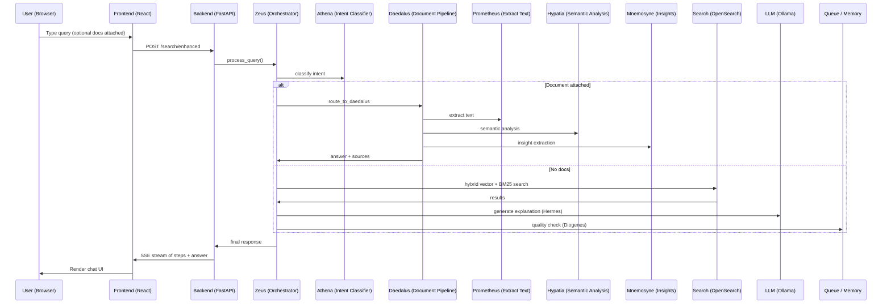

# LocaLense_V2 – Comprehensive Project Documentation

---

## Table of Contents
1. [Project Overview](#project-overview)
2. [Technology Stack](#technology-stack)
3. [Repository Structure](#repository-structure)
4. [Backend Architecture](#backend-architecture)
   - [API Endpoints](#api-endpoints)
   - [Orchestrator (Zeus)](#orchestrator-zeus)
   - [Agents](#agents)
   - [Memory & Ingestion](#memory--ingestion)
   - [Utilities](#utilities)
5. [Frontend Architecture](#frontend-architecture)
   - [React Components](#react-components)
   - [Server‑Sent Events (SSE) Flow](#sse-flow)
6. [Data Flow Diagram](#data-flow-diagram)
7. [Configuration](#configuration)
8. [Running the Application](#running-the-application)
9. [Deployment (Docker Compose)](#deployment-docker-compose)
10. [Testing & Verification](#testing--verification)
11. [Extending the System](#extending-the-system)
12. [Troubleshooting & FAQ](#troubleshooting--faq)
13. [License](#license)

---

## Project Overview
`LocaLense_V2` (also called **Vantage**) is an AI‑powered semantic document search and chat assistant. It lets users:
- Securely store and index personal documents (PDF, Word, Excel, images, plain text, etc.).
- Perform natural‑language searches across their own files using hybrid vector + BM25 retrieval.
- Attach documents to a conversation and ask follow‑up questions that are answered using a multi‑agent workflow inspired by Greek mythology.
- Get explanations, summarizations, comparisons, and quality‑checked results.

The system is built around a **Zeus** orchestrator that routes every request to the appropriate specialist agents (Athena, Daedalus, Prometheus, etc.).

---

## Technology Stack
| Layer | Technology | Purpose |
|-------|------------|---------|
| **Frontend** | React 18 + Vite | Modern SPA with hot‑reload, dark mode, and responsive UI |
| **Backend** | FastAPI (Python) | Async REST API + Server‑Sent Events (SSE) |
| **Vector DB** | OpenSearch 2.x | Hybrid vector + BM25 search |
| **LLM** | Ollama (`qwen2.5:7b`) | Local LLM for reasoning, classification, and generation |
| **Embeddings** | `nomic-embed-text` | 768‑dimensional text embeddings |
| **Storage** | SQLite | Users, conversations, memory |
| **Agent Framework** | LangGraph (optional) | State‑ful graph orchestration |
| **Python Dependencies** | See `requirements.txt` |
| **Frontend Dependencies** | React, Vite, Lucide‑react, react‑markdown |

---

## Repository Structure
```
LocaLense_V2/
├── backend/                     # FastAPI server and all agents
│   ├── api.py                  # Main FastAPI app (routes, SSE)
│   ├── auth_endpoints.py       # JWT auth (register, login, me)
│   ├── ingestion.py            # Document extraction & chunking
│   ├── memory/                 # Session & user memory manager
│   ├── orchestration/
│   │   └── orchestrator.py      # ⚡ Zeus – central orchestrator
│   ├── agents/                 # Specialist agents
│   │   ├── query_classifier.py # 🦉 Athena – intent classification
│   │   ├── analysis_agent.py   # 📊 Aristotle – document analysis
│   │   ├── clarification_agent.py # 🤔 Socrates – clarification
│   │   ├── summarization_agent.py # 📜 Thoth – summarization
│   │   ├── explanation_agent.py   # 📨 Hermes – explanations
│   │   ├── critic_agent.py        # 🔎 Diogenes – quality control
│   │   └── document_agents/
│   │       ├── daedalus_orchestrator.py # 🏛️ Daedalus – document pipeline
│   │       ├── prometheus_reader.py   # 🔥 Prometheus – text extraction
│   │       ├── hypatia_analyzer.py    # 📚 Hypatia – semantic analysis
│   │       └── mnemosyne_extractor.py # 🧠 Mnemosyne – insights
│   ├── utils/                  # Helper modules (LLM utils, OpenSearch client, etc.)
│   └── tests/                  # Unit / integration tests
├── frontend/                   # Vite + React UI
│   └── src/components/         # UI components (ChatInterface, etc.)
├── config.yaml                 # Global configuration (Ollama, OpenSearch, agents)
├── requirements.txt            # Python dependencies
├── README.md                   # High‑level README (this file expands it)
├── ARCHITECTURE.md            # Detailed architecture description
├── QUICKSTART.md               # Quick‑start guide (install & run)
└── working.md                  # Working document (auto‑generated by this task)
```

---

## Backend Architecture
### API Endpoints
Key FastAPI routes (see `backend/api.py`):
- `POST /auth/register` – Create a new user (hashed password stored in `locallens_users.json`).
- `POST /auth/login` – Issue JWT token.
- `GET /auth/me` – Return current user profile.
- `POST /search/enhanced` – Main entry point for a query. Accepts optional `attached_documents` list.
- `POST /index/directory` – Index a folder path (triggers `ingestion.py`).
- `POST /upload` – Upload a single file for immediate indexing.
- SSE endpoint `/events` streams step‑by‑step agent thinking to the UI.

### Orchestrator (**Zeus**)
Implemented in `backend/orchestration/orchestrator.py`. Responsibilities:
1. Load session context & memory.
2. Classify intent via **Athena** (`query_classifier`).
3. Route to **Athena Path** (general queries) or **Daedalus Path** (document‑attached queries).
4. Execute a LangGraph workflow when available, otherwise fall back to a simplified async pipeline.
5. Record each step with `emit_step` so the frontend can display the thinking chain.
6. Persist interaction details in `MemoryManager` (SQLite).

### Agents
| Agent | File | Role |
|-------|------|------|
| **Athena** (🦉) | `backend/agents/query_classifier.py` | Intent classification, entity extraction, filter generation |
| **Aristotle** (📊) | `backend/agents/analysis_agent.py` | Document comparison & insight generation |
| **Socrates** (🤔) | `backend/agents/clarification_agent.py` | Generate clarification questions for ambiguous queries |
| **Thoth** (📜) | `backend/agents/summarization_agent.py` | Multi‑document summarization |
| **Hermes** (📨) | `backend/agents/explanation_agent.py` | Explain relevance / ranking of results |
| **Diogenes** (🔎) | `backend/agents/critic_agent.py` | Quality evaluation & reformulation suggestions |
| **Daedalus** (🏛️) | `backend/agents/document_agents/daedalus_orchestrator.py` | Orchestrates the document pipeline when files are attached |
| **Prometheus** (🔥) | `backend/agents/document_agents/prometheus_reader.py` | Extract raw text from PDFs, images, etc. |
| **Hypatia** (📚) | `backend/agents/document_agents/hypatia_analyzer.py` | Semantic analysis, keyword extraction |
| **Mnemosyne** (🧠) | `backend/agents/document_agents/mnemosyne_extractor.py` | Insight extraction, fact synthesis |

### Memory & Ingestion
- **MemoryManager** (`backend/memory`) stores per‑session context, recent queries, and user preferences in SQLite (`locallens_memory.db`).
- **Ingestion** (`backend/ingestion.py`) extracts text, chunks it, generates embeddings via `nomic-embed-text`, and indexes into OpenSearch (`documents` index). It also updates the UI via SSE progress events.

### Utilities
- `backend/utils/llm_utils.py` – Wrapper around Ollama API (`call_ollama_with_retry`, `call_ollama_json`).
- `backend/utils/opensearch_client.py` – Thin client for hybrid search (`vector_weight`, `bm25_weight`).
- `backend/utils/logger.py` – Centralised `loguru` logger configuration.

---

## Frontend Architecture
The UI lives in `frontend/` and is built with Vite.

### React Components
- **ChatInterface.jsx** – Main chat window, handles user input, displays messages, and renders the step‑by‑step thinking chain received via SSE.
- **ChatInterface.css** – Styling (dark mode, glass‑morphism, micro‑animations).
- **Auth Pages** – Sign‑Up / Sign‑In components that store the JWT in `localStorage` and attach it to API calls.
- **IndexPanel.jsx** – UI for selecting a folder path or uploading files.

### Server‑Sent Events (SSE) Flow
1. The frontend opens an `EventSource` to `/events` after a query is submitted.
2. The backend emits JSON objects `{type: "step", agent, action, details, timestamp}` for each agent step.
3. The UI appends a visual card for each step, using icons defined in the agent metadata.
4. When the final response arrives, the UI shows the assistant message and any attached sources.

---

## Data Flow Diagram


---

## Configuration
Key sections of `config.yaml` (excerpt):
```yaml
ollama:
  base_url: "http://localhost:11434"
  text_model:
    name: "qwen2.5:7b"
    temperature: 0.7
  vision_model:
    name: "qwen2.5vl:latest"

opensearch:
  host: "localhost"
  port: 9200
  index:
    documents: "documents"
    conversations: "conversations"

search:
  hybrid:
    enabled: true
    vector_weight: 0.7
    bm25_weight: 0.3

agents:
  classifier:
    enabled: true
  clarification:
    enabled: true
  analysis:
    enabled: true
  summarization:
    enabled: true
  explanation:
    enabled: true
  critic:
    enabled: true
```
- Adjust `ollama.base_url` if Ollama runs on a different host/port.
- OpenSearch can be run via Docker (`docker-compose.yml`).
- Toggle individual agents via the `agents` block.

---

## Running the Application
### Prerequisites
- Python 3.10+ (`pip install -r requirements.txt`)
- Node.js 18+ (`cd frontend && npm install`)
- Docker (for OpenSearch) **or** a running OpenSearch instance.
- Ollama with the required models (`ollama serve`, `ollama pull nomic-embed-text`, `ollama pull qwen2.5:7b`).

### Quick Start (Windows) – `run.bat`
```bat
:: Start OpenSearch (Docker)
docker-compose up -d

:: Start Ollama (ensure it is in PATH)
ollama serve
ollama pull nomic-embed-text
ollama pull qwen2.5:7b

:: Start Backend
python -m backend.api

:: Start Frontend
cd frontend && npm run dev
```
Open your browser at `http://localhost:5173`.

---

## Deployment (Docker Compose)
`docker-compose.yml` defines services for:
- `opensearch` – the vector DB.
- `backend` – FastAPI container (exposes port 8000).
- `frontend` – Vite dev server (exposes port 5173).
- `ollama` – optional container if you prefer to run Ollama inside Docker.

To deploy:
```bash
docker compose up -d
# Backend will automatically start after OpenSearch is healthy.
```
Environment variables can be overridden via a `.env` file (e.g., `OLLAMA_BASE_URL`).

---

## Testing & Verification
- Unit tests live in `backend/tests/`. Run with `pytest backend/tests/`.
- End‑to‑end manual test:
  1. Register a user.
  2. Index a folder containing a few PDFs.
  3. Ask a query like `"show me invoices from last month"`.
  4. Verify the step‑by‑step UI shows agents Athena → Search → Hermes → Diogenes → Zeus.
  5. Check the SQLite `locallens_memory.db` for stored conversation history.

---

## Extending the System
- **Add a new agent**: create a class in `backend/agents/`, register it in `EnhancedOrchestrator.__init__`, and add a node to the LangGraph workflow (or a fallback async function).
- **Support new file types**: extend `_extract_filters` in `query_classifier.py` and update `ingestion.py` with a parser (e.g., `pptx` via `python-pptx`).
- **Swap LLM**: modify `config.yaml` to point to a different Ollama model or an external API wrapper.
- **Front‑end UI**: add new React components under `frontend/src/components/` and expose them via routes in `App.jsx`.

---

## Troubleshooting & FAQ
**OpenSearch not connecting?**
```bash
curl http://localhost:9200
docker-compose logs opensearch
```
**Ollama models missing?**
```bash
ollama list
ollama pull nomic-embed-text
ollama pull qwen2.5:7b
```
**Frontend fails to load?**
```bash
cd frontend
rm -rf node_modules package-lock.json
npm install && npm run dev
```
**Why is my query routed to Athena instead of Daedalus?**
Check that the request includes `attached_documents` (list of document IDs) and that the query contains document‑search keywords.

---

## License
MIT License

---

*Made with ❤️ using AI‑powered semantic search and the wisdom of the Greek Pantheon.*
