# Vantage - Detailed System Architecture

> Complete architectural breakdown of every component, subsystem, and data flow in the Vantage multi-agent document search system

---

## Table of Contents

1. [System Overview](#system-overview)
2. [High-Level Architecture](#high-level-architecture)
3. [Component Breakdown](#component-breakdown)
4. [Agent Architecture](#agent-architecture)
5. [Data Layer Architecture](#data-layer-architecture)
6. [Memory Architecture](#memory-architecture)
7. [Search & Retrieval Architecture](#search--retrieval-architecture)
8. [Knowledge Graph Architecture](#knowledge-graph-architecture)
9. [Ingestion Pipeline Architecture](#ingestion-pipeline-architecture)
10. [Frontend Architecture](#frontend-architecture)
11. [Infrastructure Architecture](#infrastructure-architecture)
12. [Integration Patterns](#integration-patterns)

---

## System Overview

### Purpose

Vantage is an **AI-powered semantic document search system** that allows users to:

- Index and search local documents using natural language
- Ask questions about uploaded documents
- Leverage a knowledge graph for entity-aware retrieval
- Get confidence-scored, source-cited answers

### Core Principles

| Principle | Implementation |
|-----------|----------------|
| **Local-First** | All data stays on the user's machine |
| **Multi-Agent** | 15+ specialized agents with Greek mythology naming |
| **Hybrid Search** | Vector similarity + BM25 keyword search |
| **Memory-Augmented** | 5-tier memory system for personalization |
| **Graph-Enhanced** | Knowledge graph for entity relationships |

---

## High-Level Architecture

```
┌─────────────────────────────────────────────────────────────────────────────────┐
│                                  USER INTERFACE                                  │
│                         React + Vite (ChatInterface.jsx)                        │
└─────────────────────────────────────────────────────────────────────────────────┘
                                        │
                                   HTTP/SSE
                                        ▼
┌─────────────────────────────────────────────────────────────────────────────────┐
│                                   API LAYER                                      │
│                           FastAPI (backend/api.py)                              │
│  ┌─────────────┐  ┌─────────────┐  ┌─────────────┐  ┌─────────────────────────┐ │
│  │   /search   │  │   /index    │  │  /upload    │  │  /stream-search-steps   │ │
│  └─────────────┘  └─────────────┘  └─────────────┘  └─────────────────────────┘ │
└─────────────────────────────────────────────────────────────────────────────────┘
                                        │
                                        ▼
┌─────────────────────────────────────────────────────────────────────────────────┐
│                             ORCHESTRATION LAYER                                  │
│  ┌─────────────────────────────────────────────────────────────────────────────┐│
│  │                         Zeus (EnhancedOrchestrator)                         ││
│  │                           LangGraph State Machine                            ││
│  └─────────────────────────────────────────────────────────────────────────────┘│
│         │                                                          │             │
│         ▼                                                          ▼             │
│  ┌─────────────────┐                                    ┌─────────────────────┐ │
│  │   Athena Path   │                                    │   Daedalus Path     │ │
│  │  (No Attachments)│                                    │ (With Attachments)  │ │
│  └─────────────────┘                                    └─────────────────────┘ │
└─────────────────────────────────────────────────────────────────────────────────┘
                                        │
            ┌───────────────────────────┼───────────────────────────┐
            ▼                           ▼                           ▼
┌───────────────────────┐   ┌───────────────────────┐   ┌───────────────────────┐
│     AGENT LAYER       │   │   RETRIEVAL LAYER     │   │    MEMORY LAYER       │
│ ┌───────────────────┐ │   │ ┌───────────────────┐ │   │ ┌───────────────────┐ │
│ │ Athena (Classify) │ │   │ │ OpenSearchClient  │ │   │ │  SessionMemory    │ │
│ │ Apollo (GraphRAG) │ │   │ │ CrossEncoderRerank│ │   │ │  EpisodicMemory   │ │
│ │ Odysseus (Reason) │ │   │ │ HybridSearch      │ │   │ │  ProceduralMemory │ │
│ │ Themis (Confid.)  │ │   │ │ KnowledgeGraph    │ │   │ │  UserProfile      │ │
│ │ Proteus (Adapt.)  │ │   │ └───────────────────┘ │   │ │  AgenticMemory    │ │
│ └───────────────────┘ │   └───────────────────────┘   │ └───────────────────┘ │
└───────────────────────┘                               └───────────────────────┘
                                        │
                                        ▼
┌─────────────────────────────────────────────────────────────────────────────────┐
│                                  DATA LAYER                                      │
│  ┌────────────────┐  ┌────────────────┐  ┌────────────────┐  ┌────────────────┐ │
│  │   OpenSearch   │  │     Redis      │  │    SQLite      │  │   Ollama LLM   │ │
│  │  (Vectors/BM25)│  │ (Session Cache)│  │ (Persistence)  │  │   (Inference)  │ │
│  └────────────────┘  └────────────────┘  └────────────────┘  └────────────────┘ │
└─────────────────────────────────────────────────────────────────────────────────┘
```

---

## Component Breakdown

### Directory Structure

```
Vantage/
├── backend/                          # Python Backend
│   ├── api.py                        # FastAPI entry point
│   ├── ingestion.py                  # Document ingestion pipeline
│   ├── opensearch_client.py          # OpenSearch wrapper
│   ├── reranker.py                   # Cross-encoder reranking
│   ├── streaming_steps.py            # SSE step emission
│   │
│   ├── orchestration/                # Orchestration Layer
│   │   └── orchestrator.py           # Zeus - Main orchestrator
│   │
│   ├── agents/                       # Agent Layer
│   │   ├── query_classifier.py       # Athena - Intent classification
│   │   ├── graph_rag_agent.py        # Apollo - Graph-enhanced RAG
│   │   ├── reasoning_planner.py      # Odysseus - Multi-hop reasoning
│   │   ├── adaptive_retriever.py     # Proteus - Strategy selection
│   │   ├── confidence_scorer.py      # Themis - Confidence scoring
│   │   ├── clarification_agent.py    # Socrates - Clarification
│   │   ├── analysis_agent.py         # Aristotle - Analysis
│   │   ├── summarization_agent.py    # Thoth - Summarization
│   │   ├── explanation_agent.py      # Hermes - Explanation
│   │   ├── critic_agent.py           # Diogenes - Quality control
│   │   ├── retrieval_controller.py   # Sisyphus - Corrective retrieval
│   │   │
│   │   └── document_agents/          # Document Processing Agents
│   │       ├── daedalus_orchestrator.py  # Document orchestrator
│   │       ├── prometheus_reader.py      # Content extraction
│   │       ├── hypatia_analyzer.py       # Semantic analysis
│   │       └── mnemosyne_extractor.py    # Insight extraction
│   │
│   ├── graph/                        # Knowledge Graph
│   │   ├── knowledge_graph.py        # Graph data structure
│   │   ├── entity_resolver.py        # Entity deduplication
│   │   └── relationship_extractor.py # Relationship detection
│   │
│   ├── memory/                       # Memory System
│   │   ├── memory_manager.py         # Unified memory coordinator
│   │   ├── session_memory.py         # Redis-backed sessions
│   │   ├── user_profile.py           # SQLite user profiles
│   │   ├── procedural_memory.py      # Learned behaviors
│   │   ├── episodic_memory.py        # Episode storage
│   │   └── agentic_memory.py         # A-mem notes
│   │
│   └── utils/                        # Utilities
│       ├── llm_utils.py              # Ollama wrappers
│       └── session_logger.py         # Logging utilities
│
├── frontend/                         # React Frontend
│   ├── src/
│   │   ├── App.jsx                   # Main application
│   │   ├── components/
│   │   │   ├── ChatInterface.jsx     # Chat UI
│   │   │   ├── ThinkingSteps.jsx     # Agent step display
│   │   │   ├── DocumentCard.jsx      # Search result cards
│   │   │   └── GraphViewer.jsx       # Knowledge graph visualization
│   │   └── index.css                 # Styling
│   ├── package.json
│   └── vite.config.js
│
├── config.yaml                       # Centralized configuration
├── docker-compose.yml                # Infrastructure services
├── requirements.txt                  # Python dependencies
└── run.bat                           # Startup script
```

---

## Agent Architecture

### Agent Hierarchy

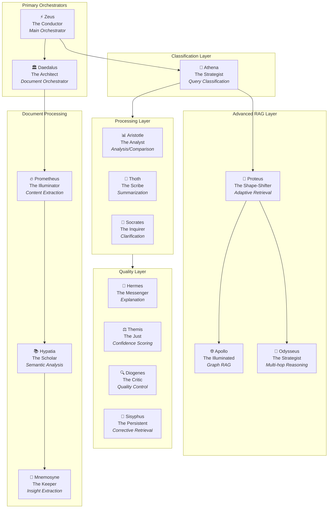

### Agent Communication Pattern

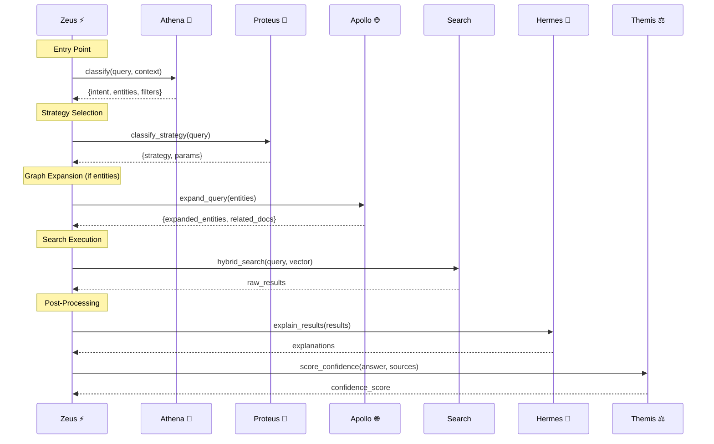

### Individual Agent Details

#### Zeus (Orchestrator)

| Property | Value |
|----------|-------|
| **File** | `backend/orchestration/orchestrator.py` |
| **Role** | Main entry point and workflow coordinator |
| **Framework** | LangGraph StateGraph |
| **Inputs** | Query, session_id, user_id, attached_documents |
| **Outputs** | Response, results, steps, confidence |

**Key Methods**:

```python
async def process_query(user_id, session_id, query, attached_documents) -> Dict
def _build_langgraph_workflow() -> StateGraph
async def _route_to_athena(...) -> Dict
async def _route_to_daedalus(...) -> Dict
```

#### Athena (Query Classifier)

| Property | Value |
|----------|-------|
| **File** | `backend/agents/query_classifier.py` |
| **Role** | Classify intent, extract entities/filters |
| **Strategy** | Rule-based + LLM fallback |
| **Outputs** | Intent, confidence, entities, filters |

**Intent Types**:

- `DOCUMENT_SEARCH` - Find files
- `GENERAL_KNOWLEDGE` - LLM-only answer
- `COMPARISON` - Compare documents
- `SUMMARIZATION` - Summarize content
- `ANALYSIS` - Analyze patterns
- `CLARIFICATION_NEEDED` - Ambiguous query

#### Apollo (Graph RAG)

| Property | Value |
|----------|-------|
| **File** | `backend/agents/graph_rag_agent.py` |
| **Role** | Graph-based query expansion |
| **Inputs** | Query, extracted entities |
| **Outputs** | Expanded entities, related documents |

**Expansion Logic**:

```
1. Match query entities in graph
2. Traverse relationships (max 2 hops)
3. Collect related entities
4. Gather document IDs containing those entities
5. Return expanded context
```

#### Odysseus (Multi-hop Reasoning)

| Property | Value |
|----------|-------|
| **File** | `backend/agents/reasoning_planner.py` |
| **Role** | Decompose complex queries |
| **Inputs** | Complex query |
| **Outputs** | Sub-queries, synthesized answer |

**Complexity Indicators**:

- "compare", "versus", "difference between"
- Multiple question marks
- "and" conjunctions
- "first...then", "before...after"

---

## Data Layer Architecture

### OpenSearch Schema

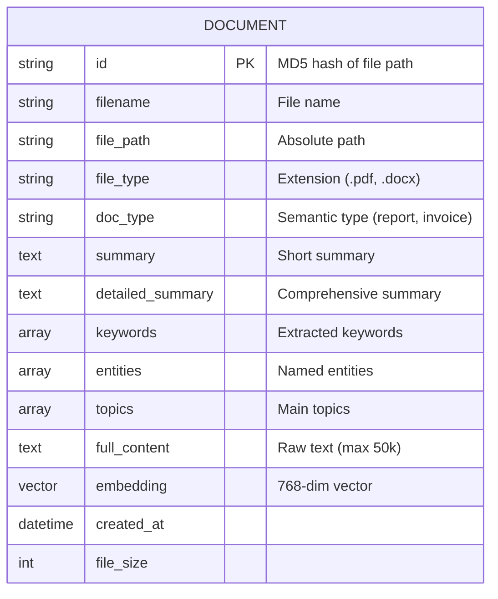

### OpenSearch Index Settings

```json
{
  "settings": {
    "index": {
      "knn": true,
      "knn.algo_param.ef_search": 100
    }
  },
  "mappings": {
    "properties": {
      "embedding": {
        "type": "knn_vector",
        "dimension": 768,
        "method": {
          "name": "hnsw",
          "space_type": "cosinesimil",
          "engine": "nmslib",
          "parameters": {
            "ef_construction": 128,
            "m": 24
          }
        }
      },
      "filename": {"type": "text", "analyzer": "standard"},
      "summary": {"type": "text", "analyzer": "english"},
      "keywords": {"type": "keyword"},
      "entities": {"type": "keyword"}
    }
  }
}
```

### SQLite Databases

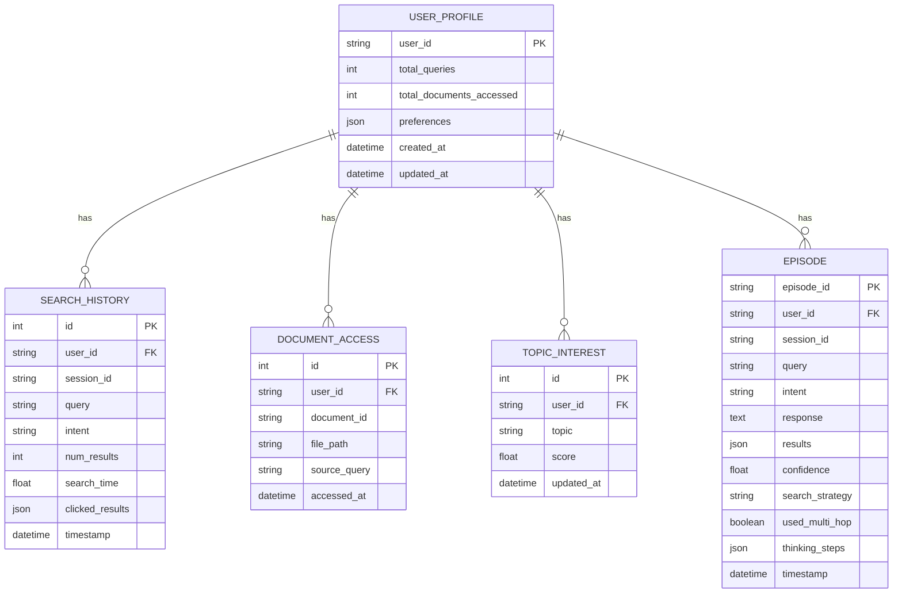

### Redis Data Structure

```
Session Key: "session:{session_id}"
TTL: 3600 seconds

Structure:
{
    "recent_queries": ["query1", "query2", ...],  # Max 10
    "topic": "current_topic",
    "intents": ["intent1", "intent2"],
    "last_results": [{...}, {...}],
    "metadata": {
        "created_at": "...",
        "last_activity": "..."
    }
}
```

---

## Memory Architecture

### 5-Tier Memory System

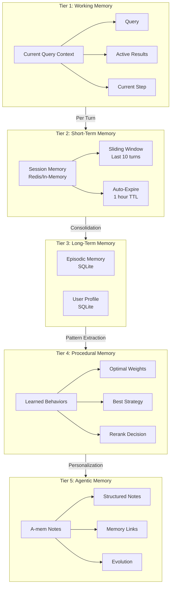

### MemoryManager Coordination

```python
class MemoryManager:
    """Coordinates all memory subsystems"""
    
    # Subsystems
    session_memory: SessionMemory       # Tier 2 - Redis
    user_profile: UserProfileManager    # Tier 3 - SQLite
    procedural_memory: ProceduralMemory # Tier 4 - In-memory
    
    # Core Operations
    async def record_interaction(...)   # Record all tiers
    async def get_context(...)          # Get session context
    async def get_user_preferences(...) # Get personalization
```

### Memory Flow on Each Query

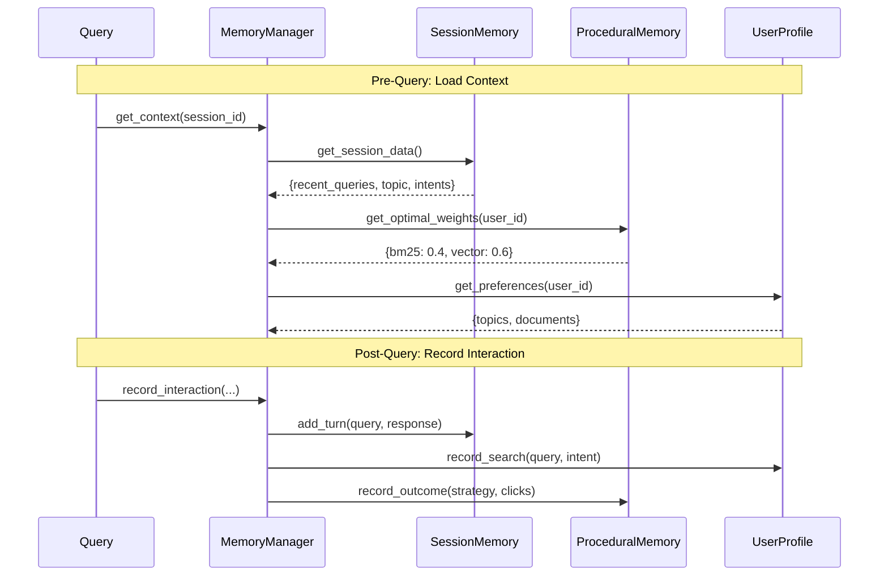

---

## Search & Retrieval Architecture

### Hybrid Search Pipeline

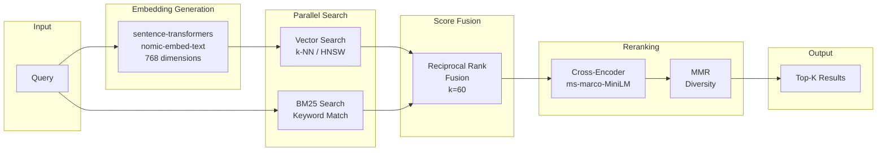

### Strategy Selection (Proteus)

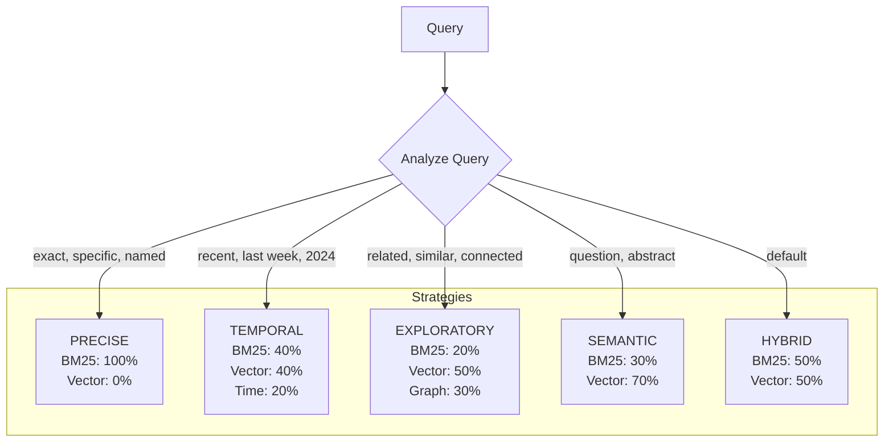

### Cross-Encoder Reranking

```
Input: (query, document_text) pairs

Model: cross-encoder/ms-marco-MiniLM-L-6-v2

Process:
1. Concatenate: "[CLS] query [SEP] document [SEP]"
2. BERT forward pass
3. Scalar relevance score
4. Sort by score
5. Optional: Apply MMR for diversity
```

### Reciprocal Rank Fusion Formula

```
For each document d:
    RRF_score(d) = Σ 1/(k + rank_i(d))
    
Where:
    k = 60 (smoothing parameter)
    rank_i(d) = rank of document d in ranker i
```

---

## Knowledge Graph Architecture

### Graph Data Model

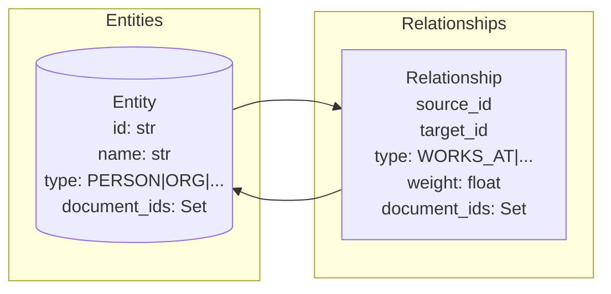

### Entity Types

| Type | Examples |
|------|----------|
| `PERSON` | John Smith, CEO, Author |
| `ORGANIZATION` | Acme Corp, MIT, FDA |
| `LOCATION` | New York, Building A |
| `DATE` | March 2024, Q1 |
| `CONCEPT` | Machine Learning, Budget |
| `PRODUCT` | iPhone, Project Alpha |

### Relationship Types

| Type | Example |
|------|---------|
| `WORKS_AT` | Person → Organization |
| `LOCATED_IN` | Entity → Location |
| `MENTIONS` | Document → Entity |
| `RELATED_TO` | Entity → Entity |
| `DATED` | Event → Date |

### Graph Operations

```python
class KnowledgeGraph:
    # Core data structures
    _entity_index: Dict[str, Entity]           # O(1) lookup
    _relationship_index: Dict[str, List]       # Adjacency list
    _document_entity_map: Dict[str, Set]       # Doc → Entities
    _name_to_ids: Dict[str, List]              # Name → Entity IDs
    
    # Operations
    def add_entity(entity_id, name, type, doc_id)
    def add_relationship(source_id, target_id, rel_type, weight)
    def find_entities_by_name(name) -> List[Entity]
    def get_related_entities(entity_id, hops=2) -> List[Tuple]
    def get_entity_context(entity_id) -> Dict
```

### Graph Traversal (Apollo)

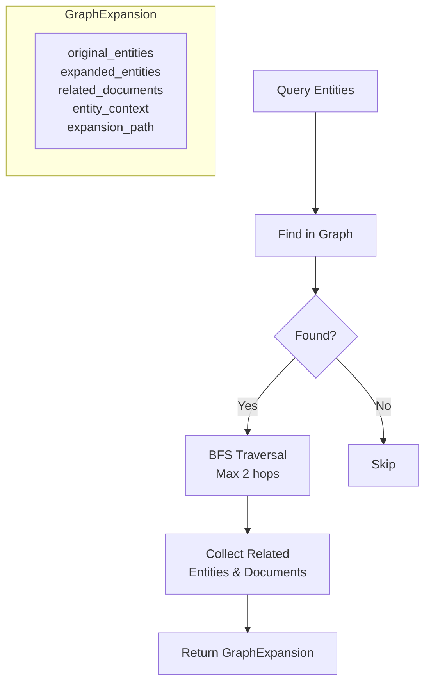

---

## Ingestion Pipeline Architecture

### Complete Ingestion Flow

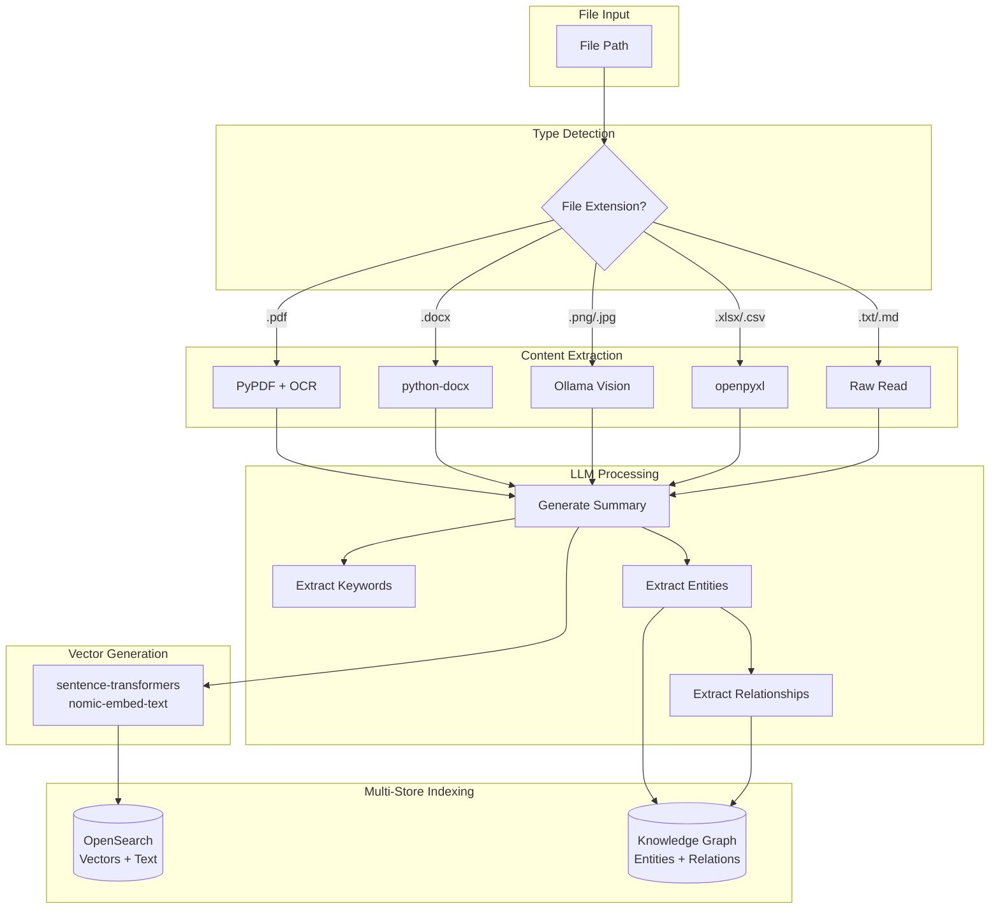

### Supported File Types

| Extension | Extractor | Notes |
|-----------|-----------|-------|
| `.pdf` | PyPDF2 | OCR for scanned PDFs |
| `.docx` | python-docx | Includes embedded images |
| `.xlsx`, `.csv` | openpyxl / csv | Preserves table structure |
| `.png`, `.jpg`, `.jpeg` | Ollama Vision | LLM image description |
| `.txt`, `.md` | Raw read | Direct text |
| `.pptx` | python-pptx | Slide by slide |

### Ingestion Pipeline Class

```python
class IngestionPipeline:
    def __init__(self, config, opensearch_client):
        # Embedding model (GPU-accelerated)
        self.embedding_model = SentenceTransformer('nomic-embed-text')
        
        # Knowledge graph
        self.knowledge_graph = KnowledgeGraph()
        
        # Graph RAG agent for entity indexing
        self.graph_rag = GraphRAGAgent(config)
    
    async def process_file(self, file_path: Path) -> Dict:
        # 1. Check if already indexed
        # 2. Extract content by type
        # 3. Generate LLM summary + entities
        # 4. Create embedding
        # 5. Index to OpenSearch
        # 6. Index to Knowledge Graph
```

---

## Frontend Architecture

### Component Hierarchy

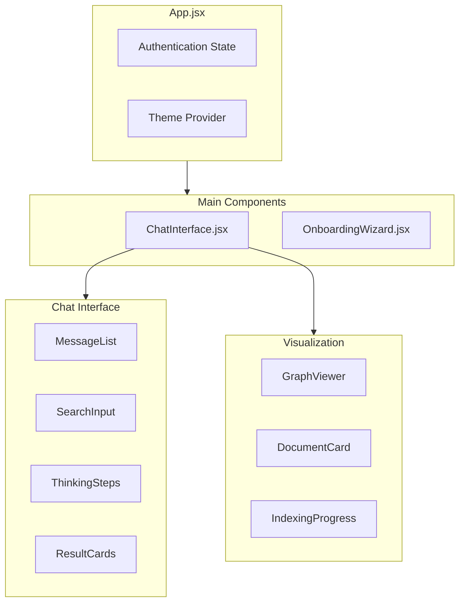

### State Management

```javascript
// App.jsx State
const [isLoggedIn, setIsLoggedIn] = useState(false);
const [userId, setUserId] = useState(null);
const [darkMode, setDarkMode] = useState(true);
const [indexingTaskId, setIndexingTaskId] = useState(null);

// ChatInterface.jsx State  
const [messages, setMessages] = useState([]);
const [isSearching, setIsSearching] = useState(false);
const [thinkingSteps, setThinkingSteps] = useState([]);
const [attachedDocuments, setAttachedDocuments] = useState([]);
```

### SSE Integration (Real-time Steps)

```javascript
// Subscribe to thinking steps
const eventSource = new EventSource(
    `/api/stream-search-steps/${sessionId}`
);

eventSource.onmessage = (event) => {
    const step = JSON.parse(event.data);
    setThinkingSteps(prev => [...prev, step]);
};
```

---

## Infrastructure Architecture

### Docker Compose Services

```yaml
services:
  opensearch:
    image: opensearchproject/opensearch:latest
    ports: ["9200:9200", "9600:9600"]
    environment:
      OPENSEARCH_INITIAL_ADMIN_PASSWORD: LocalLens@1234
      discovery.type: single-node
      plugins.security.ssl.http.enabled: false
    volumes:
      - opensearch-data:/usr/share/opensearch/data

  opensearch-dashboards:
    image: opensearchproject/opensearch-dashboards:latest
    ports: ["5601:5601"]
    environment:
      OPENSEARCH_HOSTS: '["https://opensearch:9200"]'

  redis:
    image: redis:alpine
    ports: ["6379:6379"]
    volumes:
      - redis-data:/data
```

### Service Dependencies

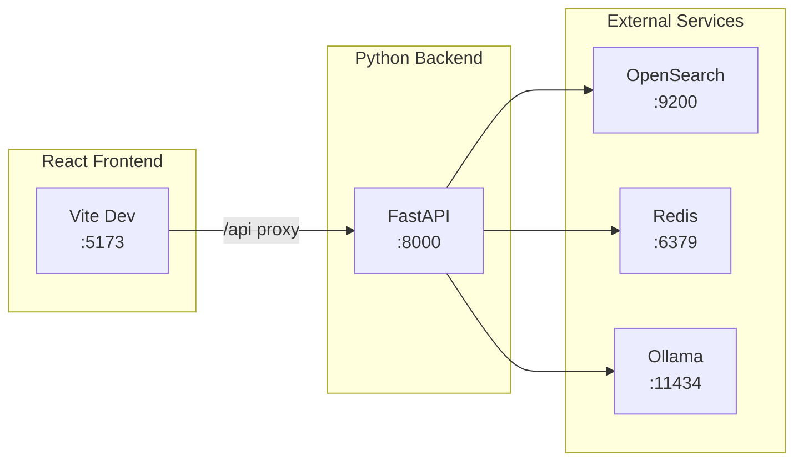

---

## Integration Patterns

### Error Handling Pattern

```python
async def call_ollama_with_retry(prompt, max_retries=3, fallback_response=""):
    for attempt in range(max_retries):
        try:
            response = await ollama_client.generate(prompt)
            return response
        except TimeoutError:
            if attempt < max_retries - 1:
                await asyncio.sleep(2 ** attempt)
            else:
                return fallback_response
        except Exception as e:
            logger.error(f"Ollama error: {e}")
            return fallback_response
```

### Streaming Pattern (SSE)

```python
# Emit step to frontend
def emit_step(session_id: str, step: Dict):
    if session_id in step_queues:
        step_queues[session_id].put(step)

# SSE endpoint
@app.get("/stream-search-steps/{session_id}")
async def stream_steps(session_id: str):
    async def generate():
        queue = step_queues.get(session_id)
        while True:
            step = await queue.get()
            yield f"data: {json.dumps(step)}\n\n"
    return StreamingResponse(generate(), media_type="text/event-stream")
```

### Agent Registration Pattern

```python
# All agents follow this interface
class BaseAgent:
    AGENT_NAME: str
    AGENT_TITLE: str
    AGENT_ICON: str
    
    def get_agent_info(self) -> Dict[str, str]:
        return {
            "name": self.AGENT_NAME,
            "title": self.AGENT_TITLE,
            "icon": self.AGENT_ICON,
            "full_name": f"{self.AGENT_NAME} ({self.AGENT_TITLE})"
        }
```

---

## Configuration Summary

### Key Configuration Paths

| Config Key | Purpose |
|------------|---------|
| `ollama.base_url` | Ollama API endpoint |
| `ollama.unified_model.name` | LLM model name |
| `opensearch.host/port` | OpenSearch connection |
| `opensearch.index_name` | Document index |
| `search.hybrid.vector_weight` | Hybrid search balance |
| `search.recall_top_k` | Initial retrieval count |
| `search.rerank_top_k` | Final result count |
| `memory.session.backend` | redis or in-memory |
| `memory.session.window_size` | Conversation turns |

---

*This architecture document provides a complete reference for understanding the Vantage system design and component interactions.*
