# Vantage Technical Deep Dive

> Exhaustive technical documentation detailing every flow, agent architecture, memory system, graph operations, and ranking mechanisms

---

## Table of Contents

1. [Executive Summary](#executive-summary)
2. [System Entry Points](#system-entry-points)
3. [The Zeus Orchestrator](#the-zeus-orchestrator)
4. [Query Processing Pipeline](#query-processing-pipeline)
5. [Agent Architectures](#agent-architectures)
6. [Memory System Deep Dive](#memory-system-deep-dive)
7. [Knowledge Graph System](#knowledge-graph-system)
8. [Ranking and Retrieval](#ranking-and-retrieval)
9. [Document Ingestion Pipeline](#document-ingestion-pipeline)
10. [Complete Flow Diagrams](#complete-flow-diagrams)
11. [Data Structures Reference](#data-structures-reference)

---

## Executive Summary

Vantage is a **multi-agent AI document search system** built on a Greek mythology-themed architecture. The system processes user queries through a sophisticated pipeline involving:

- **15+ Specialized Agents**: Each with distinct responsibilities
- **5-Tier Memory System**: Session → Episodic → Procedural → User Profile → Agentic Memory
- **Knowledge Graph**: Entity extraction, relationship mapping, graph traversal
- **Hybrid Retrieval**: Vector similarity + BM25 + Reciprocal Rank Fusion
- **LangGraph Orchestration**: Stateful workflow management

### Core Technologies

| Component | Technology | Purpose |
|-----------|------------|---------|
| Orchestration | LangGraph | Stateful multi-agent workflows |
| LLM | Ollama (qwen3-vl:8b) | All text/vision generation |
| Vector DB | OpenSearch k-NN | Semantic similarity |
| Embeddings | Sentence Transformers | Local GPU embedding |
| Reranking | Cross-Encoder | Two-stage retrieval |
| Session Store | Redis | Short-term memory |
| Persistence | SQLite | Long-term storage |

---

## System Entry Points

### 1. Main API Server (`backend/api.py`)

The FastAPI application exposes these primary endpoints:

| Endpoint | Method | Purpose |
|----------|--------|---------|
| `/search` | POST | Main search with hybrid retrieval |
| `/search/stream` | POST | SSE streaming search with agent steps |
| `/index` | POST | Index a directory of documents |
| `/health` | GET | System health check |
| `/upload` | POST | Upload and index single file |
| `/documents/{id}` | GET | Retrieve indexed document |
| `/documents/{id}/entities` | GET | Get document entities |
| `/conversations` | GET/POST | Manage conversations |
| `/watcher/enable` | POST | Enable file watcher |
| `/memory/{user_id}` | GET | Get user memory summary |

### 2. Request Models

```python
class SearchRequest(BaseModel):
    query: str                              # User's search query
    top_k: int = 5                          # Number of results
    use_hybrid: bool = True                 # Enable hybrid search
    stream_status: bool = True              # Enable SSE streaming
    session_id: Optional[str] = None        # Session for context
    user_id: Optional[str] = None           # User for personalization
    conversation_id: Optional[str] = None   # Conversation ID
    attached_documents: Optional[List[str]] = None  # Document IDs
```

### 3. Initialization Flow

```python
@app.on_event("startup")
async def startup():
    1. Load config.yaml
    2. Initialize OpenSearchClient
    3. Create index if not exists
    4. Initialize MemoryManager
    5. Initialize IngestionPipeline
    6. Initialize CrossEncoderReranker
    7. Initialize EnhancedOrchestrator (Zeus)
    8. Initialize QueryClassifier (Athena)
    9. Start background tasks
```

---

## The Zeus Orchestrator

**File**: `backend/orchestration/orchestrator.py`
**Agent**: Zeus (The Conductor) ⚡

Zeus is the **main entry point** for all query processing. It implements a routing strategy based on whether documents are attached.

### Routing Decision

```
                    USER QUERY
                        │
                        ▼
        ┌───────────────────────────────┐
        │     ZEUS (The Conductor)      │
        │     Main Orchestrator         │
        └───────────────────────────────┘
                        │
                        │
            ┌───────────┴───────────┐
            │                       │
    Has Attached Docs?      No Attached Docs
            │                       │
            ▼                       ▼
    ┌───────────────┐      ┌───────────────┐
    │   DAEDALUS    │      │   ATHENA      │
    │ (The Architect)│      │(The Strategist)│
    │ Document Path │      │ General Path  │
    └───────────────┘      └───────────────┘
```

### Zeus Implementation

```python
class EnhancedOrchestrator:
    AGENT_NAME = "Zeus"
    AGENT_TITLE = "The Conductor"
    
    def __init__(self, config, memory_manager, search_function, opensearch_client):
        # Athena Path Agents
        self.classifier = QueryClassifier(config)          # Athena
        self.clarification_agent = ClarificationAgent()    # Socrates
        self.analysis_agent = AnalysisAgent()              # Aristotle
        self.summarization_agent = SummarizationAgent()    # Thoth
        self.explanation_agent = ExplanationAgent()        # Hermes
        self.critic_agent = CriticAgent()                  # Diogenes
        
        # Daedalus Path
        self.daedalus = DaedalusOrchestrator(config)
        
        # Advanced RAG Agents
        self.graph_rag = GraphRAGAgent()                   # Apollo
        self.reasoning_planner = ReasoningPlanner()        # Odysseus
        self.adaptive_retriever = AdaptiveRetriever()      # Proteus
        self.confidence_scorer = ConfidenceScorer()        # Themis
        self.retrieval_controller = RetrievalController()  # Sisyphus
        
        # Memory
        self.memory_tool = MemoryTool(memory_manager)
        self.episodic_memory = EpisodicMemory()
        
        # LangGraph workflow
        self.workflow = self._build_langgraph_workflow()
```

### LangGraph Workflow Definition

```python
def _build_langgraph_workflow(self) -> StateGraph:
    workflow = StateGraph(WorkflowState)
    
    # Add nodes (each is a processing step)
    workflow.add_node("load_context", self._load_context_node)
    workflow.add_node("classify", self._classify_node)
    workflow.add_node("document_search", self._document_search_node)
    workflow.add_node("general_answer", self._general_answer_node)
    workflow.add_node("clarify", self._clarify_node)
    workflow.add_node("analyze", self._analyze_node)
    workflow.add_node("summarize", self._summarize_node)
    workflow.add_node("explain", self._explain_node)
    workflow.add_node("quality_check", self._quality_check_node)
    workflow.add_node("generate_response", self._generate_response_node)
    
    # Set entry point
    workflow.set_entry_point("load_context")
    
    # Define edges (transitions)
    workflow.add_edge("load_context", "classify")
    
    # Conditional routing based on intent
    workflow.add_conditional_edges(
        "classify",
        self._route_by_intent,
        {
            "document_search": "document_search",
            "general_knowledge": "general_answer",
            "clarification": "clarify",
            "comparison": "analyze",
            "summarization": "summarize",
            "analysis": "analyze"
        }
    )
    
    # Post-processing edges
    workflow.add_edge("document_search", "explain")
    workflow.add_edge("explain", "quality_check")
    workflow.add_edge("quality_check", "generate_response")
    workflow.add_edge("generate_response", END)
```

### WorkflowState Schema

```python
class WorkflowState(TypedDict):
    user_id: str
    session_id: str
    query: str
    intent: Optional[str]           # Classified intent
    confidence: float               # Classification confidence
    filters: Optional[Dict]         # Extracted filters
    entities: List[str]             # Extracted entities
    results: List[Dict[str, Any]]   # Search results
    search_time: float
    clarification_questions: List[str]
    comparison_result: Optional[Dict]
    summary: Optional[str]
    explanations: List[str]
    insights: List[str]
    quality_evaluation: Optional[Dict]
    should_reformulate: bool
    response_message: str
    suggestions: List[str]
    session_context: Optional[Dict]
    user_preferences: Optional[Dict]
    conversation_history: Optional[List[Dict[str, Any]]]
    next_action: str
    error: Optional[str]
    steps: List[Dict[str, Any]]     # Agent thinking steps (for UI)
```

---

## Query Processing Pipeline

### Complete Athena Path Flow


### Complete Daedalus Path Flow

```mermaid
sequenceDiagram
    participant U as User
    participant Zeus as Zeus ⚡
    participant Daedalus as Daedalus 🏛️
    participant Prometheus as Prometheus 🔥
    participant Hypatia as Hypatia 📚
    participant Mnemosyne as Mnemosyne 🧠
    participant LLM as Ollama

    U->>Zeus: query + attached_documents[]
    Zeus->>Daedalus: process_query(query, documents)
    
    Note over Daedalus: Step 1: Process Each Document
    loop For each document
        Daedalus->>Daedalus: Check cache
        
        alt Not Cached
            Note over Prometheus: Extract Content
            Daedalus->>Prometheus: extract([file_path])
            Prometheus->>Prometheus: _read_pdf() | _read_docx() | _read_image()
            Prometheus-->>Daedalus: ExtractedContent
            
            Note over Hypatia: Semantic Analysis
            Daedalus->>Hypatia: analyze(extracted_content)
            Hypatia->>LLM: Classify document type
            Hypatia->>LLM: Extract key concepts
            Hypatia->>LLM: Identify structure
            Hypatia-->>Daedalus: SemanticAnalysis
            
            Note over Mnemosyne: Extract Insights
            Daedalus->>Mnemosyne: extract_insights(content, analysis)
            Mnemosyne->>LLM: Generate summary
            Mnemosyne->>LLM: Extract key points
            Mnemosyne->>LLM: Identify entities
            Mnemosyne-->>Daedalus: DocumentInsights
            
            Daedalus->>Daedalus: Cache ProcessedDocument
        end
    end
    
    Note over Daedalus: Step 2: Build Combined Context
    Daedalus->>Daedalus: _build_combined_context()
    
    Note over Daedalus: Step 3: Answer Query
    Daedalus->>LLM: Generate answer from context
    LLM-->>Daedalus: answer
    
    Daedalus-->>Zeus: DocumentQueryResponse
    Zeus-->>U: {answer, sources, agents_used, thinking_steps}
```



---

## Agent Architectures

### Agent Index

| Agent | Greek Name | Symbol | Role | File |
|-------|------------|--------|------|------|
| Zeus | The Conductor | ⚡ | Main orchestrator | `orchestration/orchestrator.py` |
| Athena | The Strategist | 🦉 | Query classification | `agents/query_classifier.py` |
| Daedalus | The Architect | 🏛️ | Document orchestration | `agents/document_agents/daedalus_orchestrator.py` |
| Prometheus | The Illuminator | 🔥 | Content extraction | `agents/document_agents/prometheus_reader.py` |
| Hypatia | The Scholar | 📚 | Semantic analysis | `agents/document_agents/hypatia_analyzer.py` |
| Mnemosyne | The Keeper | 🧠 | Insight extraction | `agents/document_agents/mnemosyne_extractor.py` |
| Apollo | The Illuminated | 🌐 | Graph RAG | `agents/graph_rag_agent.py` |
| Odysseus | The Strategist | 🧭 | Multi-hop reasoning | `agents/reasoning_planner.py` |
| Proteus | The Shape-Shifter | 🔮 | Adaptive retrieval | `agents/adaptive_retriever.py` |
| Themis | The Just | ⚖️ | Confidence scoring | `agents/confidence_scorer.py` |
| Socrates | The Inquirer | 🤔 | Clarification | `agents/clarification_agent.py` |
| Aristotle | The Analyst | 📊 | Analysis/Comparison | `agents/analysis_agent.py` |
| Thoth | The Scribe | 📜 | Summarization | `agents/summarization_agent.py` |
| Hermes | The Messenger | 📨 | Explanation | `agents/explanation_agent.py` |
| Diogenes | The Critic | 🔍 | Quality control | `agents/critic_agent.py` |
| Sisyphus | The Persistent | 🔄 | Corrective retrieval | `agents/retrieval_controller.py` |

---

### Athena (Query Classifier)

**Role**: Classify query intent and extract structured information

**Classification Flow**:

```
Query → Follow-up Resolution → Rule-Based Classification → LLM Classification (if needed)
                                        ↓
                              ClassificationResult {
                                  intent: QueryIntent,
                                  confidence: float,
                                  entities: List[str],
                                  filters: Dict,
                                  clarification_questions: List[str]
                              }
```

**Intent Types**:

```python
class QueryIntent(Enum):
    DOCUMENT_SEARCH = "document_search"       # Find files
    GENERAL_KNOWLEDGE = "general_knowledge"   # LLM-only answer
    SYSTEM_META = "system_meta"               # About the system
    COMPARISON = "comparison"                 # Compare documents
    SUMMARIZATION = "summarization"           # Summarize documents
    ANALYSIS = "analysis"                     # Analyze patterns
    CLARIFICATION_NEEDED = "clarification_needed"
```

**Rule-Based Priority Order**:

1. Image/Photo keywords → `DOCUMENT_SEARCH` (0.95 confidence)
2. Comparison keywords → `COMPARISON` (0.85 confidence)
3. Summarization keywords → `SUMMARIZATION` (0.85 confidence)
4. Document + Possessive keywords → `DOCUMENT_SEARCH` (0.85 confidence)
5. General knowledge patterns → `GENERAL_KNOWLEDGE` (0.85 confidence)
6. Default → `DOCUMENT_SEARCH` (0.6 confidence)

**Filter Extraction**:

```python
# File type mapping
{
    "pdf": [".pdf"],
    "image": [".png", ".jpg", ".jpeg", ".gif", ".bmp", ".webp"],
    "spreadsheet": [".xlsx", ".xls", ".csv"],
    "word": [".docx", ".doc"],
    ...
}

# Time filter patterns
"last week" → {"time_range": "last_week"}
"Q2 2024" → {"quarter": "Q2", "year": "2024"}
"March 2024" → {"month": 3, "year": "2024"}
```

---

### Proteus (Adaptive Retriever)

**Role**: Select optimal retrieval strategy based on query characteristics

**Strategies**:

```python
class RetrievalStrategy(Enum):
    PRECISE = "precise"           # BM25/keyword heavy
    SEMANTIC = "semantic"         # Vector/embedding heavy
    EXPLORATORY = "exploratory"   # Graph traversal
    TEMPORAL = "temporal"         # Time-filtered
    HYBRID = "hybrid"             # Combined approach
```

**Strategy Parameters**:

```python
{
    PRECISE: {
        "use_bm25": True, "use_vector": False,
        "bm25_weight": 1.0, "vector_weight": 0.0,
        "min_score": 0.5
    },
    SEMANTIC: {
        "use_bm25": True, "use_vector": True,
        "bm25_weight": 0.3, "vector_weight": 0.7,
        "min_score": 0.3
    },
    EXPLORATORY: {
        "use_bm25": True, "use_vector": True, "use_graph": True,
        "bm25_weight": 0.2, "vector_weight": 0.5, "graph_weight": 0.3,
        "expand_hops": 2, "min_score": 0.2
    },
    TEMPORAL: {
        "use_bm25": True, "use_vector": True,
        "bm25_weight": 0.4, "vector_weight": 0.4, "time_weight": 0.2,
        "prefer_recent": True, "min_score": 0.3
    }
}
```

**Selection Logic**:

```
Query → Check PRECISE indicators (exact, specific, named, file, pdf, quoted)
      → Check TEMPORAL indicators (recent, latest, last week, 2024)
      → Check EXPLORATORY indicators (related to, similar, connected)
      → Check SEMANTIC indicators (questions, short queries)
      → Normalize scores → Select highest
```

---

### Apollo (Graph RAG Agent)

**Role**: Expand queries using knowledge graph for entity-based retrieval

**Expansion Flow**:

```
Query Entities → Match in Graph → Traverse Relationships → Expand Entities
                                                                ↓
                                         GraphExpansion {
                                             original_entities,
                                             expanded_entities,
                                             related_documents,
                                             entity_context,
                                             expansion_path
                                         }
```

**Graph Traversal**:

```python
async def expand_query(self, query, extracted_entities, max_hops=2):
    for entity_name in extracted_entities:
        # 1. Find entity in graph
        found = self.graph.find_entities_by_name(entity_name)
        
        for entity in found:
            # 2. Get documents containing this entity
            related_documents.update(entity.document_ids)
            
            # 3. Get entity context (relationships)
            context = self.graph.get_entity_context(entity.id)
            
            # 4. Traverse graph for related entities
            related = self.graph.get_related_entities(entity.id, hops=max_hops)
            
            for rel_entity, distance, rel_type in related:
                expanded_names.add(rel_entity.name)
                related_documents.update(rel_entity.document_ids)
```

---

### Odysseus (Reasoning Planner)

**Role**: Handle complex queries requiring multi-hop reasoning

**Complexity Detection**:

```python
COMPLEX_PATTERNS = [
    "compare", "versus", "vs", "difference between",
    "relationship between", "how does", "why did",
    "combine", "summarize all", "across all",
    "first...then", "before...after"
]

def detect_complexity(self, query):
    indicators = sum(1 for p in COMPLEX_PATTERNS if p in query.lower())
    question_marks = query.count('?')
    and_count = query.lower().count(' and ')
    
    score = indicators + question_marks + and_count
    
    if score >= 3: return "complex"
    elif score >= 1: return "moderate"
    else: return "simple"
```

**Multi-hop Flow**:

```
Complex Query → Decompose into Sub-queries → Execute Each → Synthesize Final Answer
                        ↓
                [SubQuery(id="sq1", query="...", priority=1),
                 SubQuery(id="sq2", query="...", priority=2, dependencies=["sq1"])]
                        ↓
                Loop: search(sq.query) → collect answers
                        ↓
                LLM: synthesize_answers(original_query, sub_answers)
                        ↓
                SynthesizedAnswer {answer, confidence, reasoning_trace}
```

---

### Themis (Confidence Scorer)

**Role**: Score answer confidence and generate follow-ups

**Confidence Factors**:

```python
async def score_answer_confidence(self, answer, query, sources, retrieval_quality):
    base_score = 0.5
    
    # Factor 1: Number of sources (max 0.2)
    sources_score = min(len(sources) / 5.0, 1.0) * 0.2
    
    # Factor 2: Top source quality (max 0.2)
    source_quality_score = min(sources[0].get('score', 0.5), 1.0) * 0.2
    
    # Factor 3: Answer length (max 0.15)
    if 50 < len(answer) < 2000:
        length_score = 0.15
    else:
        length_score = 0.1
    
    # Factor 4: Retrieval quality from CriticAgent (max 0.2)
    quality_score = retrieval_quality.get('quality_score', 0.5) * 0.2
    
    # Factor 5: Certainty vs Uncertainty phrases (max 0.2)
    # Checks for "clearly", "definitely" vs "might be", "unclear"
    
    return min(sum(all_scores), 1.0)
```

---

### Daedalus Document Agents

**Sub-agent Pipeline**:

```
Document → Prometheus (Extract) → Hypatia (Analyze) → Mnemosyne (Insights)
                ↓                        ↓                     ↓
        ExtractedContent         SemanticAnalysis        DocumentInsights
```

**Prometheus (Content Extraction)**:

- PDF: Uses `pypdf` for text, `pdf2image` + LLM for images
- DOCX: Uses `python-docx` for text and embedded images
- Images: Uses Ollama vision model for description
- Spreadsheets: Uses `openpyxl` for structure and content

**Hypatia (Semantic Analysis)**:

```python
@dataclass
class SemanticAnalysis:
    document_type: str         # report, invoice, contract, etc.
    key_concepts: List[str]    # Main topics
    structure: Dict            # Sections, headings
    sentiment: str             # Overall tone
    complexity: str            # Technical level
```

**Mnemosyne (Insight Extraction)**:

```python
@dataclass
class DocumentInsights:
    executive_summary: str     # 2-3 sentence summary
    key_points: List[str]      # Main takeaways
    entities: List[Dict]       # Named entities
    action_items: List[str]    # Tasks/actions if any
    questions_raised: List[str] # Open questions
```

---

## Memory System Deep Dive

**File**: `backend/memory/memory_manager.py`

### Memory Tier Architecture


### MemoryManager Coordination

```python
class MemoryManager:
    def __init__(self, redis_url, database_url, consolidation_interval=3600):
        self.session_memory = SessionMemory(redis_url)      # Redis/In-memory
        self.user_profile = UserProfileManager(database_url) # SQLite
        self.procedural_memory = ProceduralMemory()          # In-memory learning
```

### Record Interaction Flow

```python
async def record_interaction(self, user_id, session_id, query, response, 
                              results, intent, search_time, clicked_results, metadata):
    # 1. Add to session memory (sliding window)
    await self.session_memory.add_turn(
        session_id, query, response, results, intent, metadata
    )
    
    # 2. Record in long-term user profile
    await self.user_profile.record_search(
        user_id, session_id, query, intent, 
        len(results), search_time, clicked_results
    )
    
    # 3. Update topic interests
    await self.user_profile.update_topic_interest(user_id, topic)
    
    # 4. Update procedural memory (learning optimal strategies)
    self.procedural_memory.record_search_outcome(
        user_id, strategy, query, len(results), 
        clicked_positions, top_score
    )
```

### Session Memory (Redis)

```python
# Data stored per session
{
    "recent_queries": ["query1", "query2", ...],  # Last 10
    "topic": "current topic",
    "intents": ["document_search", "comparison"],
    "last_results": [...],
    "metadata": {...}
}

# TTL: 3600 seconds (1 hour)
# Fallback: In-memory dict if Redis unavailable
```

### Episodic Memory

```python
@dataclass
class Episode:
    episode_id: str
    user_id: str
    session_id: str
    query: str
    intent: str
    response: str
    results: List[Dict]
    confidence: float
    search_strategy: str
    used_multi_hop: bool
    expanded_entities: List[str]
    thinking_steps: List[Dict]
    timestamp: str
```

### Procedural Memory (Learning)

```python
class ProceduralMemory:
    def record_search_outcome(self, user_id, strategy, query, 
                               num_results, clicked_positions, top_score):
        # Track which strategies work best for each user
        # Learn optimal hybrid weights from click patterns
        
    def get_optimal_weights(self, user_id) -> Dict[str, float]:
        # Return learned BM25/vector weights for this user
        
    def get_best_strategy(self, user_id) -> str:
        # Return most successful strategy for user
        
    def should_rerank(self, user_id) -> bool:
        # Determine if reranking helps this user
```

### User Preferences Aggregation

```python
async def get_user_preferences(self, user_id) -> Dict[str, Any]:
    return {
        **await self.user_profile.get_personalized_preferences(user_id),
        "optimal_weights": self.procedural_memory.get_optimal_weights(user_id),
        "best_strategy": self.procedural_memory.get_best_strategy(user_id),
        "frequently_accessed": await self.user_profile.get_frequently_accessed_documents(user_id),
        "should_rerank": self.procedural_memory.should_rerank(user_id)
    }
```

---

## Knowledge Graph System

**Files**: `backend/graph/`

### Knowledge Graph Structure

```python
class KnowledgeGraph:
    _entity_index: Dict[str, Entity]       # entity_id -> Entity
    _relationship_index: Dict[str, List]   # source_id -> [(target_id, rel)]
    _document_entity_map: Dict[str, Set]   # doc_id -> entity_ids
    _name_to_ids: Dict[str, List]          # entity_name -> entity_ids
```

### Entity Model

```python
@dataclass
class Entity:
    id: str                     # Unique identifier
    name: str                   # Display name
    entity_type: str            # PERSON, ORGANIZATION, CONCEPT, etc.
    document_ids: Set[str]      # Documents containing this entity
    properties: Dict[str, Any]  # Additional metadata
    created_at: datetime
```

### Relationship Model

```python
@dataclass
class Relationship:
    source_id: str
    target_id: str
    relationship_type: str      # WORKS_AT, MENTIONS, RELATED_TO
    weight: float               # Confidence 0.0-1.0
    properties: Dict[str, Any]
    document_ids: Set[str]      # Documents proving this relationship
```

### Graph Operations

**Add Entity**:

```python
def add_entity(self, entity_id, name, entity_type, document_id):
    if entity_id in self._entity_index:
        # Update existing entity with new document
        self._entity_index[entity_id].document_ids.add(document_id)
    else:
        # Create new entity
        entity = Entity(id=entity_id, name=name, entity_type=entity_type, ...)
        self._entity_index[entity_id] = entity
        self._name_to_ids.setdefault(name.lower(), []).append(entity_id)
    
    # Update document-entity mapping
    self._document_entity_map.setdefault(document_id, set()).add(entity_id)
```

**Get Related Entities (Graph Traversal)**:

```python
def get_related_entities(self, entity_id, hops=2):
    visited = set()
    results = []
    queue = [(entity_id, 0, None)]  # (id, distance, relationship)
    
    while queue:
        current_id, distance, rel_type = queue.pop(0)
        
        if current_id in visited or distance > hops:
            continue
        
        visited.add(current_id)
        
        if distance > 0:
            results.append((self._entity_index[current_id], distance, rel_type))
        
        # Add neighbors to queue
        for target_id, rel in self._relationship_index.get(current_id, []):
            queue.append((target_id, distance + 1, rel))
    
    return results
```

### Entity Resolution

```python
class EntityResolver:
    def resolve(self, name, entity_type, existing_entities):
        # 1. Exact match
        for e in existing_entities:
            if e['name'].lower() == name.lower() and e['type'] == entity_type:
                return ResolvedEntity(canonical_id=e['id'], canonical_name=e['name'])
        
        # 2. Fuzzy match (similarity > 0.85)
        for e in existing_entities:
            similarity = self._calculate_similarity(name, e['name'])
            if similarity > 0.85 and e['type'] == entity_type:
                return ResolvedEntity(canonical_id=e['id'], canonical_name=e['name'])
        
        # 3. No match - will create new entity
        return None
```

### Relationship Extraction

```python
class RelationshipExtractor:
    async def extract_relationships(self, text, entities, document_id):
        prompt = f"""Extract relationships between these entities from the text:
        
        Entities: {entities}
        Text: {text[:2000]}
        
        Return JSON: {{
            "relationships": [
                {{"source": "Entity1", "target": "Entity2", 
                  "type": "WORKS_AT", "confidence": 0.8, "evidence": "..."}}
            ]
        }}"""
        
        result = await call_ollama_json(prompt)
        return [ExtractedRelationship(**r) for r in result['relationships']]
```

---

## Ranking and Retrieval

### Hybrid Search Flow


### OpenSearch Hybrid Search

```python
async def hybrid_search(self, query, query_vector, top_k=50, filters=None):
    # 1. Vector (k-NN) search
    vector_query = {
        "knn": {
            "embedding": {
                "vector": query_vector,
                "k": top_k
            }
        }
    }
    
    # 2. BM25 text search
    bm25_query = {
        "multi_match": {
            "query": query,
            "fields": ["summary^3", "filename^2", "keywords", "full_content"],
            "type": "best_fields",
            "fuzziness": "AUTO"
        }
    }
    
    # Execute both
    vector_hits = await self.client.search(body={"query": vector_query})
    bm25_hits = await self.client.search(body={"query": bm25_query})
    
    # 3. Reciprocal Rank Fusion
    return self._reciprocal_rank_fusion(vector_hits, bm25_hits, k=60)
```

### Reciprocal Rank Fusion (RRF)

```python
def _reciprocal_rank_fusion(self, vector_hits, bm25_hits, k=60):
    """
    RRF formula: score = Σ (1 / (k + rank))
    
    Combines rankings from vector and BM25 searches.
    Default k=60 as per original RRF paper.
    """
    scores = {}
    
    # Score from vector results
    for rank, hit in enumerate(vector_hits, 1):
        doc_id = hit['_id']
        scores[doc_id] = scores.get(doc_id, 0) + (1.0 / (k + rank))
    
    # Score from BM25 results
    for rank, hit in enumerate(bm25_hits, 1):
        doc_id = hit['_id']
        scores[doc_id] = scores.get(doc_id, 0) + (1.0 / (k + rank))
    
    # Sort by combined score
    sorted_docs = sorted(scores.items(), key=lambda x: x[1], reverse=True)
    
    return [doc_id for doc_id, score in sorted_docs]
```

### Cross-Encoder Reranking

```python
class CrossEncoderReranker:
    def __init__(self, config):
        self.model = CrossEncoder('cross-encoder/ms-marco-MiniLM-L-6-v2')
        
    def rerank(self, query, documents, top_k=5, diversity_weight=0.0):
        # 1. Create query-document pairs
        pairs = [(query, self._get_doc_text(doc)) for doc in documents]
        
        # 2. Score all pairs
        scores = self.model.predict(pairs)
        
        # 3. Normalize scores (sigmoid transformation)
        normalized = self._normalize_scores(scores)
        
        # 4. Optional: Apply MMR for diversity
        if diversity_weight > 0:
            indices = self._mmr_rerank(normalized, documents, top_k, diversity_weight)
        else:
            indices = np.argsort(normalized)[::-1][:top_k]
        
        # 5. Return reranked documents
        return [documents[i] for i in indices]
```

### MMR (Maximal Marginal Relevance)

```python
def _mmr_rerank(self, scores, documents, top_k, diversity_weight):
    """
    MMR formula: MMR = argmax [λ * Sim(d, q) - (1-λ) * max(Sim(d, d'))]
    
    Balances relevance with diversity.
    """
    selected = []
    remaining = list(range(len(documents)))
    
    while len(selected) < top_k and remaining:
        best_score = -float('inf')
        best_idx = None
        
        for idx in remaining:
            relevance = scores[idx]
            
            # Calculate max similarity to already selected docs
            max_sim = 0
            for sel_idx in selected:
                sim = self._doc_similarity(documents[idx], documents[sel_idx])
                max_sim = max(max_sim, sim)
            
            # MMR score
            mmr = (1 - diversity_weight) * relevance - diversity_weight * max_sim
            
            if mmr > best_score:
                best_score = mmr
                best_idx = idx
        
        selected.append(best_idx)
        remaining.remove(best_idx)
    
    return selected
```

---

## Document Ingestion Pipeline

**File**: `backend/ingestion.py`

### Ingestion Flow


### IngestionPipeline Class

```python
class IngestionPipeline:
    def __init__(self, config, opensearch_client, status_callback=None):
        self.config = config
        self.opensearch = opensearch_client
        self.status_callback = status_callback
        
        # Load embedding model (local, GPU-accelerated)
        self.embedding_model = SentenceTransformer('nomic-embed-text')
        if torch.cuda.is_available():
            self.embedding_model = self.embedding_model.to('cuda')
        
        # Knowledge graph for entity indexing
        self.knowledge_graph = KnowledgeGraph()
```

### Process File Flow

```python
async def process_file(self, file_path: Path):
    # 1. Generate document ID (hash of path)
    doc_id = hashlib.md5(str(file_path).encode()).hexdigest()
    
    # 2. Skip if already indexed
    if await self.opensearch.document_exists(doc_id):
        return None
    
    # 3. Extract content based on file type
    content = await self._extract_content(file_path)
    # Returns: {raw_text, tables, images, metadata}
    
    # 4. Classify document type
    doc_type = self._classify_document(file_path, content)
    # Returns: "report", "invoice", "contract", etc.
    
    # 5. Generate detailed summary with LLM
    summary_result = await self._generate_detailed_summary(content, file_path)
    # Returns: {summary, keywords, entities, topics, relationships}
    
    # 6. Generate embedding
    embedding = self.generate_embedding(summary_result['summary'])
    
    # 7. Build document for indexing
    document = {
        "id": doc_id,
        "filename": file_path.name,
        "file_path": str(file_path),
        "file_type": file_path.suffix.lower(),
        "doc_type": doc_type,
        "summary": summary_result['summary'],
        "detailed_summary": summary_result['summary'],
        "keywords": summary_result['keywords'],
        "entities": summary_result['entities'],
        "topics": summary_result['topics'],
        "full_content": content['raw_text'][:50000],
        "embedding": embedding,
        "created_at": datetime.now().isoformat(),
        "file_size": file_path.stat().st_size
    }
    
    # 8. Index to OpenSearch
    await self.opensearch.index_document(document)
    
    # 9. Index entities and relationships to knowledge graph
    await self._index_to_knowledge_graph(
        doc_id, file_path.name,
        summary_result['entities'],
        summary_result['relationships'],
        content['raw_text']
    )
    
    return document
```

### LLM Summarization Prompt

```python
async def _process_text_detailed(self, content, file_path, session_log=None):
    prompt = f"""Analyze this document and provide a comprehensive analysis.

Document: {file_path.name}
Content:
{content['raw_text'][:10000]}

Provide your analysis in this EXACT format:

## Summary
[2-4 sentences describing the document's main purpose and content]

## Keywords
[5-10 important keywords, comma-separated]

## Entities
[Named entities like people, organizations, locations, dates]

## Topics
[Main topics and themes covered]

## Relationships
[If applicable: relationships between entities, e.g., "John WORKS_AT Company X"]

Respond with the analysis:"""

    response = await call_ollama_with_retry(prompt, ...)
    
    # Parse structured response
    return self._parse_detailed_response(response)
```

### Embedding Generation

```python
def generate_embedding(self, text: str) -> List[float]:
    """
    Generate embedding using local sentence-transformers.
    Much more stable than Ollama embeddings.
    """
    # Truncate to model's max length
    max_tokens = 8192
    truncated = text[:max_tokens * 4]  # Rough char estimate
    
    # Generate embedding
    with torch.no_grad():
        embedding = self.embedding_model.encode(
            truncated,
            convert_to_numpy=True,
            normalize_embeddings=True
        )
    
    return embedding.tolist()
```

---

## Complete Flow Diagrams

### End-to-End Search Flow

```mermaid
flowchart TB
    subgraph User["User Interface"]
        UI[ChatInterface.jsx]
    end
    
    subgraph API["FastAPI Backend"]
        Endpoint[/search endpoint]
    end
    
    subgraph Orchestration["Zeus Orchestrator"]
        Zeus[Zeus ⚡]
        Route{Attached Docs?}
    end
    
    subgraph AthenaPath["Athena Path"]
        Athena[Athena 🦉<br/>Classify Intent]
        Proteus[Proteus 🔮<br/>Strategy]
        Apollo[Apollo 🌐<br/>Graph Expand]
        Search[Hybrid Search]
        Rerank[CrossEncoder<br/>Rerank]
        Odysseus[Odysseus 🧭<br/>Multi-hop]
        Hermes[Hermes 📨<br/>Explain]
        Themis[Themis ⚖️<br/>Confidence]
    end
    
    subgraph DaedalusPath["Daedalus Path"]
        Daedalus[Daedalus 🏛️]
        Prometheus[Prometheus 🔥<br/>Extract]
        Hypatia[Hypatia 📚<br/>Analyze]
        Mnemosyne[Mnemosyne 🧠<br/>Insights]
    end
    
    subgraph Memory["Memory System"]
        Session[Session Memory]
        Episodic[Episodic Memory]
        Profile[User Profile]
    end
    
    subgraph Storage["Data Storage"]
        OS[(OpenSearch)]
        KG[(Knowledge Graph)]
        Redis[(Redis)]
        SQLite[(SQLite)]
    end
    
    UI -->|POST /search| Endpoint
    Endpoint --> Zeus
    
    Zeus --> Route
    Route -->|YES| Daedalus
    Route -->|NO| Athena
    
    Athena --> Proteus
    Proteus --> Apollo
    Apollo --> KG
    Apollo --> Search
    Search --> OS
    Search --> Rerank
    
    Athena -->|Complex| Odysseus
    Odysseus --> Search
    
    Rerank --> Hermes
    Hermes --> Themis
    Themis --> Zeus
    
    Daedalus --> Prometheus
    Prometheus --> Hypatia
    Hypatia --> Mnemosyne
    Mnemosyne --> Daedalus
    Daedalus --> Zeus
    
    Zeus --> Session
    Zeus --> Episodic
    Session --> Redis
    Episodic --> SQLite
    Profile --> SQLite
    
    Zeus -->|Response| UI
```

---

## Data Structures Reference

### OpenSearch Document Schema

```json
{
  "id": "md5_hash",
  "filename": "report.pdf",
  "file_path": "/path/to/report.pdf",
  "file_type": ".pdf",
  "doc_type": "report",
  "summary": "Short summary...",
  "detailed_summary": "Comprehensive summary...",
  "keywords": ["keyword1", "keyword2"],
  "entities": ["Person A", "Company B"],
  "topics": ["finance", "quarterly"],
  "full_content": "Full document text (up to 50k chars)",
  "embedding": [0.1, 0.2, ...],  // 768 dimensions
  "created_at": "2024-01-15T10:30:00Z",
  "file_size": 102400
}
```

### Agent Step (for UI)

```json
{
  "type": "step",
  "agent": "🦉 Athena (The Strategist)",
  "action": "Analyzing Intent",
  "details": "Query: find my invoices",
  "timestamp": "2024-01-15T10:30:00Z"
}
```

### Search Response

```json
{
  "status": "success",
  "response_message": "I found 5 relevant documents...",
  "results": [
    {
      "id": "doc_id",
      "filename": "invoice.pdf",
      "file_path": "/path/to/invoice.pdf",
      "score": 0.85,
      "detailed_summary": "...",
      "keywords": ["invoice", "payment"]
    }
  ],
  "count": 5,
  "intent": "document_search",
  "confidence": 0.92,
  "search_time": 0.45,
  "total_time": 1.2,
  "routing_path": "Zeus → Athena → Search → Hermes → Themis",
  "steps": [...],
  "suggested_followups": ["Show more invoices", "Filter by date"]
}
```

---

## Configuration Reference

### Key Configuration Sections

```yaml
# Ollama LLM Settings
ollama:
  base_url: "http://localhost:11434"
  timeout: 500
  unified_model:
    name: "qwen3-vl:8b"
    temperature: 0.3
    max_tokens: 15000

# OpenSearch Settings
opensearch:
  host: "localhost"
  port: 9200
  index_name: "locallens_index"
  use_ssl: true
  auth:
    username: "admin"
    password: "LocalLens@1234"

# Search Configuration
search:
  hybrid:
    enabled: true
    vector_weight: 0.7
    bm25_weight: 0.3
  recall_top_k: 50     # Initial retrieval
  rerank_top_k: 5      # After reranking
  min_score: 0.3

# Memory Configuration
memory:
  session:
    backend: "redis"
    redis_url: "redis://localhost:6379"
    window_size: 10
    ttl_seconds: 3600
  
  agentic_memory:
    enabled: true
    generation:
      max_keywords: 5
    evolution:
      similarity_threshold: 0.7
      max_links_per_note: 10

# Agent Configuration
agents:
  classifier:
    enabled: true
    use_llm_fallback: true
    confidence_threshold: 0.8
```

---

## Performance Metrics

| Operation | Typical Latency | Bottleneck |
|-----------|----------------|------------|
| Query Classification | 200-500ms | LLM if rule-based fails |
| Strategy Selection | <50ms | Rule-based heuristics |
| Graph Expansion | 50-200ms | Graph traversal |
| Hybrid Search | 100-300ms | OpenSearch query |
| Reranking | 200-500ms | Cross-encoder GPU inference |
| Confidence Scoring | 50-100ms | Heuristic calculation |
| Multi-hop Decomposition | 500-1000ms | LLM decomposition |
| Multi-hop Synthesis | 500-1000ms | LLM synthesis |
| Document Extraction | 1-10s/doc | PDF parsing, OCR |
| Document Summarization | 5-20s/doc | LLM generation |
| Embedding Generation | 50-100ms/doc | GPU embedding |

---

*This document was generated from comprehensive analysis of the Vantage codebase.*
